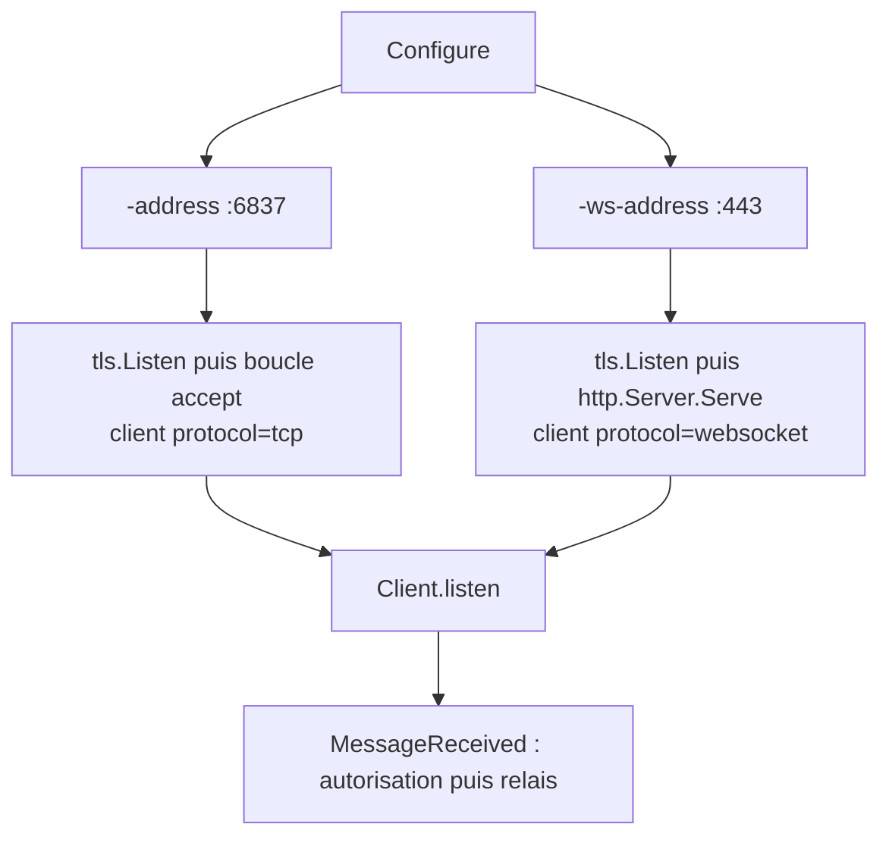
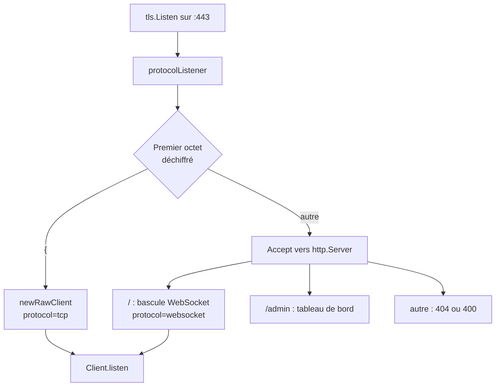

# TCP et WebSocket sur le même port 443

Ce document explique comment le serveur NVDA Remote Go accepte, sur une seule et
même adresse, les connexions des anciens clients NVDA Remote et celles des
clients récents utilisant WebSocket. Il est destiné aussi bien aux personnes qui
exploitent le serveur qu'aux développeurs qui doivent en reprendre le code.

Dépôt de référence : `https://github.com/accessolutions/NVDA-Remote-GO`, branche `main`.

---

## 1. Contexte du problème

L'historique du projet est le suivant.

1. À l'origine, le serveur n'écoutait que sur le port `6837`.
2. Le port `443` a été ajouté pour les réseaux d'entreprise qui ne laissent
   sortir que le trafic HTTPS.
3. Le transport WebSocket a ensuite été implémenté, et le port `443` lui a été
   entièrement dédié.

C'est cette troisième étape qui a créé le problème : à partir de ce moment, une
connexion NVDA Remote historique arrivant sur le port `443` était reçue par un
serveur HTTP, qui ne comprenait pas le message envoyé et répondait
`400 Bad Request` avant de fermer la connexion. Les anciens clients configurés
sur `443` ne pouvaient donc plus se connecter du tout.

L'objectif est de rétablir leur fonctionnement **sans** rien changer côté
client, et **sans** dégrader le WebSocket ni le port `6837`.

| Type de connexion | Port | État attendu |
|---|---:|---|
| Protocole historique | 6837 | Fonctionne (inchangé) |
| Protocole historique | 443 | Fonctionne à nouveau |
| WebSocket | 443 | Fonctionne (inchangé) |

---

## 2. Fonctionnement du serveur

### 2.1 Avant la modification

Le serveur crée un objet `Server` par adresse configurée. La méthode `Listen`
choisissait l'un ou l'autre de deux modes exclusifs.



Une connexion parlant le protocole historique et arrivant sur la branche de
droite n'avait aucune chance d'être servie.

### 2.2 Après la modification

Un multiplexeur est intercalé entre l'écouteur TLS et le serveur HTTP, sur les
adresses `-ws-address` uniquement.



Le port `6837` n'est pas concerné : il conserve exactement le chemin précédent.

### 2.3 Fichiers concernés

| Fichier | Rôle |
|---|---|
| [server/protomux.go](server/protomux.go) | Le multiplexeur : détection, aiguillage, échéances |
| [server/protomux_test.go](server/protomux_test.go) | Les tests réseau du multiplexeur |
| [server/connection.go](server/connection.go) | Structure `Server`, `Listen`, `accept`, `newRawClient` |
| [server/websocket.go](server/websocket.go) | `listenWebSocket`, `handleWebSocket` |
| [server/messageconn.go](server/messageconn.go) | Abstraction `MessageConn`, `rawConn`, `wsConn` |
| [server/configure.go](server/configure.go) | Le drapeau `-ws-raw` |
| [server/defaults.go](server/defaults.go) | `DEFAULT_WS_RAW` |

---

## 3. La différence entre le protocole historique et WebSocket

C'est le point central du document, et celui qui rend la solution simple.

**Les deux protocoles sont transportés par TLS.** Le nom « TCP brut » employé
dans les discussions est trompeur : le serveur n'a jamais accepté de TCP en
clair. Sur `6837` comme sur `443`, le client commence par une poignée de main
TLS strictement identique.

La différence n'apparaît qu'**après** le déchiffrement, sur le premier octet du
flux applicatif.

| Protocole | Premiers octets déchiffrés | Premier octet |
|---|---|---|
| NVDA Remote historique | `{"type": "protocol_version", "version": 2}\n` | `{` (0x7B) |
| WebSocket | `GET / HTTP/1.1\r\nHost: ...` | `G` (0x47) |

Il n'existe aucun chevauchement possible :

- le protocole historique est une suite d'objets JSON séparés par des retours à
  la ligne, donc il commence **toujours** par une accolade ouvrante ;
- une requête HTTP commence **toujours** par un nom de méthode en majuscules
  ASCII (`GET`, `POST`, `HEAD`, `OPTIONS`, `PRI` pour la préface HTTP/2…).

Un seul octet suffit donc à trancher, de façon déterministe. C'est le principe
retenu.

Deux faits vérifiés dans le code rendent cette approche sûre :

1. **Le serveur ne parle jamais en premier.** `Client.listen` commence par
   `conn.ReadMessage()`, et le message du jour n'est envoyé qu'en réponse à
   `join`. Attendre le premier octet du client ne peut donc pas provoquer
   d'interblocage.
2. **Les clients envoient immédiatement.** Le module client émet
   `protocol_version` puis `join` dès la fin de la poignée de main. La détection
   est donc quasi instantanée en pratique.

---

## 4. Architecture retenue

Un multiplexeur applicatif interne au serveur, sans dépendance nouvelle et sans
proxy inverse.

### 4.1 Principe

L'objet `protocolListener` implémente l'interface standard `net.Listener`. Il
enveloppe l'écouteur TLS et se place devant `http.Server.Serve`. Pour chaque
connexion acceptée, il lance une goroutine de classification qui :

1. pose une échéance de 10 secondes sur la connexion ;
2. force la poignée de main TLS avec cette échéance ;
3. crée un `bufio.Reader` et lit le premier octet **sans le consommer** (`Peek`) ;
4. **retire l'échéance** ;
5. si l'octet est `{`, enregistre directement un client historique ;
   sinon, transmet la connexion à `Accept`, qui la rend au serveur HTTP.

### 4.2 Pseudo-code

```
Accept() sur l'écouteur TLS
  └─ une goroutine par connexion :
       SetDeadline(maintenant + 10 s)
       HandshakeContext(ctx)              → erreur : fermer + journal LOG_DEBUG
       reader = bufio.NewReader(conn)
       octet, err = reader.Peek(1)        → erreur : fermer + journal LOG_DEBUG
       SetDeadline(zéro)                  ← ÉTAPE CRITIQUE
       si octet == '{' :
           client = newRawClient(conn, reader)
           go client.listen()
       sinon :
           conns <- &peekedConn{conn, reader}
```

### 4.3 Les deux pièges évités

**Le lecteur tamponné doit être transmis, jamais recréé.** L'appel `Peek(1)`
provoque une lecture réelle du système, qui remplit le tampon avec tout ce qui
est disponible — souvent le message complet. Si l'on transmettait ensuite la
`net.Conn` nue, ces octets seraient définitivement perdus. C'est pourquoi :

- `newRawConnWithReader` accepte un `bufio.Reader` déjà amorcé ;
- `peekedConn` redirige `Read` vers le lecteur tamponné et délègue tout le reste
  à la connexion sous-jacente.

**L'échéance doit être retirée après la détection.** Sans l'étape 4, chaque
connexion serait fermée dix secondes après son établissement, y compris une
session en cours. C'est l'erreur la plus courante dans ce type de code.

### 4.4 Pourquoi une goroutine par connexion

Si la détection avait lieu directement dans la boucle `Accept`, un seul client
lent ou malveillant, se connectant sans rien envoyer, bloquerait l'acceptation
de **toutes** les autres connexions pendant dix secondes. La classification est
donc systématiquement déportée.

---

## 5. Raisons du choix

Cinq architectures ont été envisagées.

| Solution | Verdict | Motif |
|---|---|---|
| **Multiplexage dans le serveur** | **Retenue** | Répond à tous les objectifs, aucune dépendance, aucun changement client |
| Proxy inverse (nginx, HAProxy) | Écartée | `ssl_preread` ne lit que le `ClientHello`, donc **avant** le déchiffrement : il ne voit pas la différence entre les deux protocoles. Il faudrait terminer le TLS dans le proxy, ce qui impose de déplacer le certificat, de perdre l'IP source réelle et de refondre Certbot et le tableau de bord |
| Ports distincts | Écartée | Ne résout pas le cas des clients non migrés ni des réseaux où seul `443` est ouvert, qui est précisément le scénario visé |
| Port supplémentaire (8443) | Écartée | Ne satisfait pas l'exigence « même IP, même port » |
| Détection par ALPN | Écartée | Les anciens clients ne proposent aucun ALPN, ce sont justement eux qu'il faut servir |

La solution retenue a également l'avantage d'être réversible instantanément par
un simple drapeau, sans reconstruction d'image.

---

## 6. Étapes de l'implémentation

### 6.1 `server/protomux.go` (nouveau)

Contient quatre éléments.

- `rawProtocolPrefix` : la constante `'{'`.
- `protocolDetectTimeout` : dix secondes. C'est une variable et non une
  constante, uniquement pour que les tests puissent la raccourcir.
- `peekedConn` : enveloppe une `net.Conn` en redirigeant `Read` vers un
  `bufio.Reader` déjà amorcé.
- `protocolListener` : l'implémentation de `net.Listener` décrite en section 4,
  avec `run`, `classify`, `abort`, `Accept`, `Close` et `Addr`.

### 6.2 `server/messageconn.go`

`newRawConn` délègue désormais à une nouvelle fonction
`newRawConnWithReader(conn, reader, terminator)`, qui accepte un lecteur déjà
amorcé, ou `nil` pour en créer un. Le comportement existant est inchangé.

### 6.3 `server/connection.go`

- La structure `Server` reçoit deux champs : `rawFallback` (le multiplexage
  est-il actif) et `resolved` (l'adresse réellement écoutée, utile quand le port
  `0` est demandé, notamment dans les tests).
- Le corps de la boucle `accept` est extrait dans une méthode
  `newRawClient(conn, reader)`, désormais partagée entre la boucle historique et
  le multiplexeur. L'ordre des verrous `msl` puis `s` est scrupuleusement
  conservé, pour éviter tout interblocage avec l'arrêt du serveur.
- Une méthode `Addr()` expose l'adresse effective.

### 6.4 `server/websocket.go`

Quand `rawFallback` est actif, l'écouteur TLS est enveloppé dans un
`protocolListener` avant d'être passé à `httpServer.Serve`. La goroutine d'arrêt
ferme cet écouteur enveloppant, qui ferme à son tour l'écouteur TLS.

L'ordre est important : le contexte du serveur (`s.ctx`) doit être créé **avant**
la construction du multiplexeur, puisque les clients historiques y sont
rattachés.

### 6.5 `server/configure.go` et `server/defaults.go`

Ajout du drapeau `-ws-raw`, de la valeur `DEFAULT_WS_RAW = true` et de la
fonction de comparaison `default_ws_raw`. Un avertissement est journalisé si le
drapeau est modifié alors qu'aucune adresse WebSocket n'est configurée.

### 6.6 Ce qui n'a pas été modifié

- Le port `6837` et sa boucle d'acceptation.
- `Client.listen`, `MessageReceived`, `Authorize`, la gestion des canaux, le
  partage d'écran, l'historique administratif.
- Le fichier de configuration JSON (`server/cfg.go`) : comme `ws_address` et
  `ws_path`, le nouveau drapeau est un paramètre de ligne de commande
  exclusivement.

---

## 7. Configuration

### 7.1 Le drapeau `-ws-raw`

| Valeur | Comportement |
|---|---|
| `true` (défaut) | Les adresses `-ws-address` acceptent le WebSocket **et** le protocole historique |
| `false` | Comportement antérieur : les adresses `-ws-address` n'acceptent que le WebSocket |

Le drapeau n'a d'effet que si au moins une adresse `-ws-address` est configurée.
Il n'a **aucun** effet sur les adresses `-address`.

### 7.2 Aucun changement obligatoire

La ligne de commande de production existante continue de fonctionner telle
quelle, et bénéficie automatiquement du nouveau comportement :

```
/nvdaRemoteServer -conf-read=false \
  -cert-file /etc/letsencrypt/live/nvdaremote.accessolutions.fr/fullchain.pem \
  -key-file  /etc/letsencrypt/live/nvdaremote.accessolutions.fr/privkey.pem \
  -admin -admin-password-file /data/admin.hash -admin-path /admin \
  -admin-data-file /data/admin-history.db \
  -ws-address :443 -ws-path /
```

---

## 8. Compilation et lancement

### 8.1 En local

```console
$ go build ./...
$ go vet ./...
$ go test ./... -count=1
```

Le détecteur de concurrence nécessite un compilateur C :

```console
$ CGO_ENABLED=1 go test ./server/ -race -count=1
```

Sous Windows sans `gcc` dans le `PATH`, cette commande échoue avec
`cgo: C compiler "gcc" not found`. Ce n'est pas un échec des tests : il faut
alors lancer `-race` depuis Linux ou une machine disposant de `gcc`.

### 8.2 Binaire statique

```console
$ ./build-static.sh
```

### 8.3 Image Docker

```console
$ docker build -t nvdaremoteserver-admin:mux .
$ docker run --network host nvdaremoteserver-admin:mux \
    /nvdaRemoteServer -conf-read=false -ws-address :443
```

Deux pièges connus, déjà rencontrés sur ce projet.

- Le `Dockerfile` utilise `CMD` et non `ENTRYPOINT`. Il faut donc écrire
  `/nvdaRemoteServer` explicitement avant les options, sans quoi Docker tente
  d'exécuter l'option comme un programme.
- Un `git archive` produit des scripts `.sh` avec des fins de ligne CRLF, ce qui
  casse la construction sous Alpine. Corriger avant de construire :

```console
$ sed -i 's/\r$//' *.sh
```

---

## 9. Tests

### 9.1 Tests automatisés

Le fichier [server/protomux_test.go](server/protomux_test.go) démarre un vrai
serveur sur un port éphémère local, avec un certificat auto-signé généré à la
volée, et raccourcit l'échéance de détection à 500 ms.

| Test | Ce qu'il vérifie |
|---|---|
| `TestMuxRawClient` | Un client historique sur l'adresse WebSocket obtient une réponse et est enregistré avec `protocol == "tcp"` |
| `TestMuxWebSocketClient` | Un client WebSocket fonctionne et est enregistré avec `protocol == "websocket"` |
| `TestMuxPlainHTTPRequestIsRejected` | Une requête HTTPS ordinaire reçoit `400`, sans créer de client |
| `TestMuxUnknownProtocolIsRejected` | Des octets inconnus reçoivent `HTTP/1.1 400`, sans créer de client |
| `TestMuxSilentConnectionIsClosed` | Une connexion muette est fermée à l'échéance, sans client fantôme |
| `TestMuxSlowClientIsClassified` | Un client émettant octet par octet, à 20 ms d'intervalle, est correctement classé et son message reste intègre |
| `TestMuxAbortDuringDetection` | Une connexion coupée juste après la poignée de main ne laisse ni client ni fuite |
| `TestMuxConcurrentConnections` | 30 connexions simultanées mêlant les deux protocoles sont toutes servies |
| `TestMuxRawFallbackDisabled` | Avec `-ws-raw=false`, le protocole historique est de nouveau refusé |
| `TestPeekedConnReplaysBufferedBytes` | Les octets consommés pendant la détection sont bien restitués |

Résultat obtenu :

```console
$ go test ./server/ -run 'TestMux|TestPeeked' -count=1 -v
--- PASS: TestMuxRawClient (1.05s)
--- PASS: TestMuxWebSocketClient (1.02s)
--- PASS: TestMuxPlainHTTPRequestIsRejected (0.02s)
--- PASS: TestMuxUnknownProtocolIsRejected (0.02s)
--- PASS: TestMuxSilentConnectionIsClosed (0.51s)
--- PASS: TestMuxSlowClientIsClassified (1.50s)
--- PASS: TestMuxAbortDuringDetection (0.22s)
--- PASS: TestMuxConcurrentConnections (1.05s)
--- PASS: TestMuxRawFallbackDisabled (0.01s)
--- PASS: TestPeekedConnReplaysBufferedBytes (0.00s)
PASS
ok      github.com/tech10/nvdaRemoteServer/server       9.677s
```

La suite complète (`go test ./...`) passe également, ce qui confirme l'absence de
régression sur la géolocalisation, l'historique et le partage d'écran.

### 9.2 Tests manuels

Outils nécessaires : `openssl`, `websocat` (ou le module Python `websockets`),
`curl`.

**Protocole historique sur 6837 — référence de non-régression**

```console
$ openssl s_client -quiet -connect nvdaremote.accessolutions.fr:6837
{"type":"join","channel":"essai","connection_type":"master"}
```

Réussite : réception d'un message `{"type":"channel_joined",...}`.

**Protocole historique sur 443 — le test du correctif**

```console
$ openssl s_client -quiet -connect nvdaremote.accessolutions.fr:443
{"type":"join","channel":"essai","connection_type":"master"}
```

Réussite : même réponse que sur `6837`. Avant le correctif, cette commande
renvoyait `400 Bad Request`.

**WebSocket sur 443**

```console
$ websocat wss://nvdaremote.accessolutions.fr:443/ --protocol nvdaremote/2.0
{"type":"join","channel":"essai","connection_type":"slave"}
```

Réussite : réception de `channel_joined`.

**Tableau de bord administratif**

```console
$ curl -I https://nvdaremote.accessolutions.fr/admin
```

Réussite : une réponse HTTP valide, pas une connexion fermée.

**Protocole inconnu**

```console
$ printf 'BONJOUR\r\n\r\n' | openssl s_client -quiet -connect nvdaremote.accessolutions.fr:443
```

Réussite : `HTTP/1.1 400 Bad Request`.

**Connexion muette**

```console
$ openssl s_client -connect nvdaremote.accessolutions.fr:443
```

Réussite : le serveur ferme la connexion au bout d'environ dix secondes.

### 9.3 Test de bout en bout

Le test le plus significatif, à faire avant toute mise en production.

Deux postes NVDA sur le **même canal** :

- poste A : transport historique, port `443` ;
- poste B : transport WebSocket, port `443`.

Réussite : la commande à distance fonctionne dans les deux sens. Cela prouve que
les deux transports partagent bien le même canal côté serveur, et donc que le
multiplexage n'a pas créé deux univers séparés.

### 9.4 Vérification de sécurité

- Aucun nouveau chemin d'authentification : toute connexion, quel que soit son
  transport, passe par `Client.listen` puis `MessageReceived` puis `Authorize`.
- `/admin` n'est joignable que par la branche HTTP. Une connexion classée
  « historique » ne peut structurellement plus atteindre le routeur HTTP.
- L'échéance de détection **améliore** la situation antérieure : jusqu'ici,
  `http.Server` était créé sans `ReadTimeout`, donc une connexion muette sur
  `443` était conservée indéfiniment.

---

## 10. Problèmes connus

### 10.1 `Request.TLS` vaut `nil`

`net/http` renseigne `Request.TLS` en faisant une assertion de type vers
`*tls.Conn`. Comme la connexion est enveloppée dans un `peekedConn`, cette
assertion échoue et le champ reste `nil`.

Conséquence pratique : nulle. Le code d'administration ne consulte jamais
`r.TLS` et fixe `Secure: true` en dur sur ses cookies. Mais **tout code futur
qui voudrait lire `r.TLS` devra en tenir compte**, par exemple en ajoutant une
méthode passe-plat sur `peekedConn`.

### 10.2 HTTP/2

`NextProtos` n'est pas renseigné dans la configuration TLS, donc HTTP/2 n'est
jamais négocié. Si un jour il devait l'être, la préface HTTP/2 commence par
`PRI * HTTP/2.0`, donc par `P` : elle serait correctement dirigée vers la branche
HTTP. Aucune adaptation ne serait nécessaire.

### 10.3 Proxy inverse

Si un proxy inverse devait un jour être placé devant le serveur, il devrait
fonctionner en **passthrough TCP** (nginx `stream` avec `ssl_preread`, ou
HAProxy en mode `tcp`), car le TLS doit impérativement rester terminé par le
serveur Go. Un proxy HTTP classique casserait le protocole historique.

---

## 11. Limites de la solution

1. La détection repose sur le fait que **le client parle en premier**. C'est
   vrai pour les deux protocoles concernés, mais ce serait à revérifier pour
   tout protocole ajouté ultérieurement.
2. Un protocole futur dont le premier octet serait `{` sans être du NVDA Remote
   serait mal classé. Le cas est théorique.
3. La détection ne porte que sur un octet. Elle ne valide pas la conformité du
   message, ce qui reste le rôle de `Authorize`.
4. Le multiplexage n'est pas activé sur le port `6837`, par choix délibéré de
   non-régression.

---

## 12. Procédure de retour arrière

Trois niveaux, du plus léger au plus lourd.

**Niveau 1 — désactiver le multiplexage.** Ajouter `-ws-raw=false` à la ligne de
commande et redémarrer. Le comportement redevient strictement celui de la
version `470ccc4`. Aucune reconstruction d'image n'est nécessaire.

**Niveau 2 — revenir à l'image précédente.**

```console
$ docker stop nvdaremote-go_nvdaremote_1
$ docker rm nvdaremote-go_nvdaremote_1
# recréer le conteneur à partir de nvdaremoteserver-admin:history-470ccc4
# en réutilisant les volumes certbot et admin_data
```

Attention : le conteneur de production n'a pas de libellés Compose, il faut donc
le recréer à la main en réattachant les volumes.

**Niveau 3 — restauration complète.** La sauvegarde du 09/08/2026 se trouve dans
`/home/accesso/nvdaremote-backups/20260809` sur `it0`, avec sa procédure
`RESTAURATION.md`. Le dépôt porte l'étiquette `prod-20260809`.

---

## 13. Migration des anciens clients

**Il n'y a plus de migration obligatoire.** C'est l'objet même de ce correctif :
un ancien client configuré sur le port `443` fonctionne de nouveau sans être
reconfiguré.

Deux remarques.

Le client TeleNVDA comporte, dans `configuration.py`, une réécriture
automatique de `443` vers `6837` lorsque le transport est `tcp` et que l'hôte est
le relais connu. Ce contournement devient inutile une fois le serveur corrigé.
Le retirer relève d'une décision distincte, sur le dépôt client.

La colonne `protocol` de l'historique administratif permet de **mesurer** la
population restante : le tableau de bord distingue les clients `tcp` des clients
`websocket`, y compris sur le port `443`. C'est la donnée à surveiller pour
décider, plus tard, si le mode historique peut être abandonné.

---

## 14. Exemples de configuration

### 14.1 Production, exposition directe

```console
$ docker run -d --name nvdaremote \
    -p 443:443 -p 6837:6837 \
    -v nvdaremote-go_certbot_config:/etc/letsencrypt:ro \
    -v nvdaremote-go_admin_data:/data \
    nvdaremoteserver-admin:mux \
    /nvdaRemoteServer -conf-read=false \
      -cert-file /etc/letsencrypt/live/exemple.fr/fullchain.pem \
      -key-file  /etc/letsencrypt/live/exemple.fr/privkey.pem \
      -admin -admin-password-file /data/admin.hash \
      -admin-path /admin -admin-data-file /data/admin-history.db \
      -ws-address :443 -ws-path /
```

### 14.2 Configuration minimale d'essai

```console
$ ./nvdaRemoteServer -conf-read=false -address :6837 -ws-address :8443
```

Le serveur génère alors son propre certificat auto-signé.

### 14.3 Retour au comportement antérieur

```console
$ ./nvdaRemoteServer -conf-read=false -ws-address :443 -ws-raw=false
```

### 14.4 Derrière un proxy inverse, en passthrough

Cette configuration nginx n'est **pas** utilisée en production, elle est fournie
pour référence. Le TLS reste terminé par le serveur Go.

```nginx
stream {
    upstream nvdaremote {
        server 127.0.0.1:8443;
    }
    server {
        listen 443;
        proxy_pass nvdaremote;
    }
}
```

Un proxy HTTP classique (`server { location / { proxy_pass ... } }`) ne
conviendrait pas : il ne saurait pas transporter le protocole historique.

---

## 15. Pour les développeurs débutants

### 15.1 Ce qu'est un `net.Listener`

C'est une interface Go à trois méthodes : `Accept`, `Close`, `Addr`. `Accept`
bloque jusqu'à l'arrivée d'une connexion, puis la renvoie.

L'astuce de ce correctif est que **n'importe quel objet respectant cette
interface peut être passé à `http.Server.Serve`**. Le serveur HTTP ne sait pas,
et n'a pas besoin de savoir, d'où viennent les connexions qu'on lui donne. Le
`protocolListener` en profite pour ne lui transmettre que les connexions HTTP,
et traiter les autres lui-même.

### 15.2 Pourquoi le `bufio.Reader` doit être transmis

`Peek(n)` garantit de renvoyer `n` octets **sans les retirer** du tampon. Mais
pour cela, il doit d'abord lire depuis le système, et il lit alors tout ce qui
est disponible — souvent bien plus que `n`.

Ces octets sont maintenant dans le tampon du `bufio.Reader`, plus dans la
connexion. Si l'on créait un nouveau lecteur sur la connexion, ils seraient
perdus, et le message du client arriverait tronqué. D'où la règle absolue :
**toujours transmettre le même lecteur en aval.**

### 15.3 Pourquoi une goroutine par connexion

Une goroutine est un fil d'exécution très léger. En lancer une par connexion est
idiomatique en Go.

Ici c'est indispensable : si la détection se faisait dans la boucle `Accept`,
une seule connexion silencieuse gèlerait le serveur entier pendant dix secondes.
En déportant la détection, la boucle `Accept` reste toujours disponible.

### 15.4 Lire un rapport `-race`

Le détecteur de concurrence signale les accès simultanés non synchronisés à une
même variable. Son rapport indique deux piles d'appels : l'écriture et la
lecture fautives. Il faut chercher quel verrou (`sync.Mutex`) protège la donnée
concernée, et vérifier qu'il est bien pris dans les deux chemins.

Dans ce code, deux verrous coexistent : `msl` (global) et celui du `Server`.
**L'ordre est toujours `msl` puis `Server`.** Inverser cet ordre à un seul
endroit suffirait à créer un interblocage.

### 15.5 Points d'entrée pour explorer le code

1. [server/configure.go](server/configure.go) — la lecture des paramètres et la
   construction des serveurs.
2. [server/connection.go](server/connection.go) — la structure `Server` et le
   mode historique.
3. [server/protomux.go](server/protomux.go) — le multiplexeur, le cœur du sujet.
4. [server/client.go](server/client.go) — la boucle de lecture d'un client.
5. [server/server.go](server/server.go) — le relais des messages entre clients.

### 15.6 Comment vérifier une modification

```console
$ go build ./...          # cela compile-t-il ?
$ go vet ./...            # erreurs courantes détectées statiquement
$ go test ./... -count=1  # les tests passent-ils ?
```

L'option `-count=1` désactive le cache de résultats, ce qui garantit une
exécution réelle.
