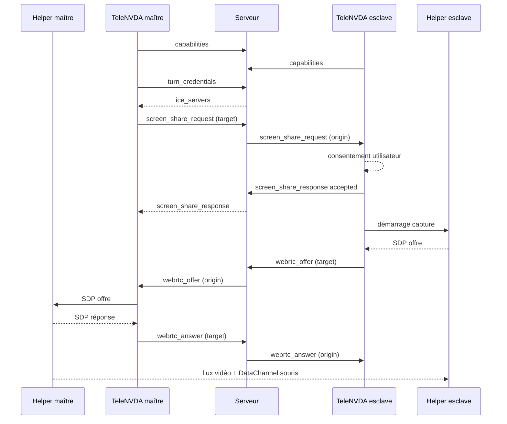

# Spécification d'implémentation — helper de partage d'écran WebRTC

Ce document décrit précisément ce qu'il faut écrire côté client pour utiliser la
signalisation ajoutée au serveur NVDA Remote. Il complète
[docs/partage-ecran-webrtc.md](docs/partage-ecran-webrtc.md), qui expose les choix
d'architecture ; ici, seule l'implémentation concrète est traitée.

**Périmètre retenu : session utilisateur uniquement.** Le helper s'exécute dans la
session interactive de l'utilisateur, avec ses droits. Le bureau sécurisé
(Winlogon, UAC, écran de verrouillage) est hors périmètre : la capture s'y
interrompt et l'injection d'entrées y est refusée par Windows. La section 11
décrit le comportement attendu dans ce cas.

---

## 1. Vue d'ensemble

Trois processus par poste :

| Processus | Rôle | Langage |
|---|---|---|
| NVDA + TeleNVDA | connexion existante au serveur, interface utilisateur, envoi et réception des messages de signalisation | Python |
| `nvdaremote-screen-helper.exe` | capture d'écran, encodage, transport WebRTC, injection d'entrées | Go, `pion/webrtc` |
| Serveur NVDA Remote | routage de la signalisation, distribution des identifiants TURN | Go, déjà déployé |

Le média **ne passe jamais** par le serveur NVDA Remote. Il transite en pair à
pair, ou par un relais TURN si le pair à pair échoue.



Point crucial : **l'offre SDP part de l'esclave**, c'est-à-dire du poste dont
l'écran est partagé, puisque c'est lui qui possède la piste vidéo.

---

## 2. Serveur de test disponible

L'instance de test est déployée et fonctionnelle, **en parallèle de la production
qui reste inchangée**.

| Paramètre | Valeur |
|---|---|
| Hôte | `nvdaremote.accessolutions.fr` |
| WebSocket | `wss://nvdaremote.accessolutions.fr:8443/` |
| TLS brut (protocole historique) | `nvdaremote.accessolutions.fr:6838` |
| Sous-protocole WebSocket | `nvdaremote/2.0` |
| Certificat | Let's Encrypt, valide jusqu'au 5 novembre 2026 |
| Partage d'écran | activé (`-screen-share`) |
| Conteneur | `nvdaremote-screenshare-test` |

La production reste sur `:443` (WebSocket) et `:6837` (TLS brut) et n'a pas la
fonctionnalité activée.

**Avertissement TURN.** Les URL `stun:nvdaremote.accessolutions.fr:3478` et
`turn:nvdaremote.accessolutions.fr:3478?transport=udp` sont configurées, mais
**aucun serveur coturn n'est encore installé**. Le serveur renverra donc ces URL,
mais elles ne répondront pas. Pour les premiers essais, utilisez un STUN public
dans le helper (par exemple `stun:stun.l.google.com:19302`) ; le pair à pair
fonctionnera dans la plupart des cas hors NAT symétrique.

---

## 3. Protocole de signalisation — messages exacts

Tous les messages sont du JSON encodé en UTF-8, **une ligne par message,
terminée par `\n`**, comme le protocole NVDA Remote existant.

### 3.1 `capabilities` — déclaration des capacités

Envoyé par le client, dans les deux sens, **avant ou après le `join`**. À
renvoyer après chaque reconnexion.

```json
{"type": "capabilities", "capabilities": ["screen_share/1", "input_control/1"]}
```

Le serveur applique une liste blanche : seules `screen_share/1` et
`input_control/1` sont acceptées, les valeurs inconnues sont silencieusement
supprimées, les doublons éliminés, et la liste plafonnée à 8 entrées. Le serveur
n'envoie aucun accusé de réception.

Les capacités sont ensuite diffusées aux autres clients du canal dans
`client_joined` et `channel_joined` :

```json
{"type": "client_joined", "client": {"id": 3, "connection_type": "slave", "capabilities": ["screen_share/1", "input_control/1"]}}
```

```json
{"type": "channel_joined", "origin": 4, "clients": [{"id": 3, "connection_type": "slave", "capabilities": ["screen_share/1"]}], "channel": "monCanal", "user_ids": [3]}
```

Le champ `capabilities` est **absent** si le client n'a rien déclaré. TeleNVDA
doit donc traiter son absence comme « ne sait pas partager l'écran » et griser
l'option correspondante.

### 3.2 `turn_credentials` — demande d'identifiants ICE

Requête, sans paramètre :

```json
{"type": "turn_credentials"}
```

Réponse :

```json
{"type": "turn_credentials", "ice_servers": [{"urls": ["stun:nvdaremote.accessolutions.fr:3478"]}, {"urls": ["turn:nvdaremote.accessolutions.fr:3478?transport=udp"], "username": "1786425600:7", "credential": "n2K9m0Q6Yy0Tb1cVv8bV0z5R3fA="}], "ttl": 3600}
```

- `username` a la forme `<expiration_unix>:<id_utilisateur>`.
- `credential` est `base64(HMAC-SHA1(secret_partagé, username))`.
- `ttl` est la durée de validité en secondes.

Ces identifiants doivent être demandés **juste avant** de créer la
`RTCPeerConnection`, jamais mis en cache au-delà de `ttl` moins une marge de
60 secondes. Pour une session longue, redemandez-les avant expiration ; ils ne
sont utilisés qu'à l'allocation TURN, une session déjà établie n'est pas
interrompue par leur expiration.

Erreurs possibles : `screen_share_unsupported` (capacité non déclarée),
`not_authorized` (maître non autorisé), `turn_unavailable` (aucune URL
configurée), `invalid_parameters` (pas encore dans un canal).

### 3.3 `screen_share_request` — demande de partage

Envoyé par le **maître** vers l'**esclave** dont il veut voir l'écran.

```json
{"type": "screen_share_request", "target": 3, "quality": "auto", "cursor": true, "input": true}
```

| Champ | Type | Obligatoire | Sens |
|---|---|---|---|
| `target` | entier | oui | identifiant du destinataire |
| `quality` | chaîne | non | `"low"`, `"medium"`, `"high"` ou `"auto"` |
| `cursor` | booléen | non | inclure le pointeur dans l'image |
| `input` | booléen | non | le maître demande aussi le contrôle des entrées |

Le serveur ajoute `origin` et transmet **au seul destinataire** :

```json
{"type": "screen_share_request", "target": 3, "quality": "auto", "cursor": true, "input": true, "origin": 4}
```

Les champs inconnus du serveur sont transmis tels quels : le protocole applicatif
entre les deux helpers reste extensible sans modifier le serveur.

### 3.4 `screen_share_response` — acceptation ou refus

Envoyé par l'esclave, après consentement explicite de son utilisateur.

Acceptation :

```json
{"type": "screen_share_response", "target": 4, "accepted": true, "input": true, "screens": [{"index": 0, "width": 1920, "height": 1080, "primary": true}, {"index": 1, "width": 2560, "height": 1440, "primary": false}]}
```

Refus :

```json
{"type": "screen_share_response", "target": 4, "accepted": false, "reason": "declined"}
```

Valeurs de `reason` recommandées : `"declined"` (refus utilisateur),
`"unavailable"` (helper absent ou en échec), `"busy"` (déjà en session),
`"timeout"` (aucune réponse dans le délai imparti).

`input` dans la réponse est la décision finale de l'esclave : le maître peut
demander le contrôle, l'esclave peut n'accorder que la vue.

### 3.5 `webrtc_offer` — offre SDP

Émis par l'esclave.

```json
{"type": "webrtc_offer", "target": 4, "sdp": "v=0\r\no=- 4611731400430051336 2 IN IP4 127.0.0.1\r\n..."}
```

Le SDP est transmis **tel quel, avec ses `\r\n` échappés en JSON**. Ne le
reformatez ni ne le tronquez : un SDP complet dépasse souvent 4 Ko.

### 3.6 `webrtc_answer` — réponse SDP

Émis par le maître.

```json
{"type": "webrtc_answer", "target": 3, "sdp": "v=0\r\no=- 8123... \r\n..."}
```

### 3.7 `webrtc_candidate` — candidat ICE

Émis dans les deux sens, à chaque candidat découvert (trickle ICE).

```json
{"type": "webrtc_candidate", "target": 3, "candidate": "candidate:842163049 1 udp 1677729535 90.12.34.56 51234 typ srflx raddr 192.168.1.20 rport 51234 generation 0 ufrag k3Rf network-cost 999", "sdpMid": "0", "sdpMLineIndex": 0}
```

Fin de collecte : envoyez `"candidate": ""`.

### 3.8 `screen_share_stop` — arrêt

Émis par l'une ou l'autre extrémité.

```json
{"type": "screen_share_stop", "target": 3, "reason": "user_stopped"}
```

Valeurs de `reason` : `"user_stopped"`, `"error"`, `"disconnected"`,
`"secure_desktop"`.

À l'arrêt, fermez la `RTCPeerConnection`, libérez les ressources de capture, et
émettez un signal sonore côté esclave.

### 3.9 Erreurs renvoyées par le serveur

```json
{"type": "error", "error": "target_not_found"}
```

| Code | Cause |
|---|---|
| `screen_share_unsupported` | l'émetteur ou le destinataire n'a pas déclaré `screen_share/1` |
| `not_authorized` | maître non authentifié sur un serveur avec mot de passe |
| `invalid_parameters` | `target` absent, nul, négatif, ou égal à son propre identifiant |
| `target_not_found` | destinataire inexistant dans le canal, ou maître non autorisé |
| `turn_unavailable` | aucune URL ICE configurée sur le serveur |

**Limite de débit.** Le serveur accepte au maximum 250 messages de signalisation
par tranche de 10 secondes et par client. Au-delà, les messages sont
**silencieusement rejetés**, sans message d'erreur. Cette marge est largement
suffisante pour du trickle ICE ; elle ne l'est pas pour transporter des données
applicatives. N'utilisez jamais la signalisation comme canal de données.

---

## 4. Séquence complète, pas à pas

Côté maître (celui qui regarde) :

1. À la connexion : envoyer `capabilities`.
2. Sur réception de `channel_joined` ou `client_joined`, mémoriser quels
   identifiants possèdent `screen_share/1`. Activer l'option « Afficher l'écran
   distant » uniquement pour ceux-là.
3. À l'activation par l'utilisateur : envoyer `turn_credentials`, attendre la
   réponse.
4. Envoyer `screen_share_request` avec `target`.
5. Armer un délai d'attente de 30 secondes. Sans `screen_share_response`,
   abandonner et informer l'utilisateur.
6. Sur `screen_share_response` avec `accepted: true`, démarrer le helper local en
   mode récepteur en lui transmettant les `ice_servers`.
7. Sur `webrtc_offer`, transmettre le SDP au helper, récupérer la réponse,
   l'envoyer en `webrtc_answer`.
8. Relayer les `webrtc_candidate` dans les deux sens.
9. Sur connexion établie, afficher la fenêtre vidéo.

Côté esclave (celui dont l'écran est partagé) :

1. À la connexion : envoyer `capabilities`.
2. Sur `screen_share_request`, **afficher une demande de consentement explicite**
   indiquant l'identifiant du demandeur et si le contrôle des entrées est
   demandé. Ne jamais accepter automatiquement.
3. Après acceptation : envoyer `turn_credentials`, démarrer le helper en mode
   émetteur avec les `ice_servers`, la liste des écrans et le drapeau `input`.
4. Envoyer `screen_share_response` avec `accepted: true` et la liste des écrans.
5. Le helper produit l'offre : l'envoyer en `webrtc_offer`.
6. Sur `webrtc_answer`, transmettre au helper.
7. Relayer les `webrtc_candidate`.
8. Émettre un signal sonore distinctif au démarrage et à l'arrêt du partage, et
   afficher un indicateur persistant.

---

## 5. Interface entre TeleNVDA et le helper

Le helper est un exécutable séparé afin qu'un plantage du sous-système média
n'entraîne pas NVDA. Communication par socket TCP sur `127.0.0.1`.

### 5.1 Démarrage

TeleNVDA génère un jeton aléatoire de 32 octets, l'encode en hexadécimal, puis
lance :

```
nvdaremote-screen-helper.exe --port 0 --token-fd 3
```

Le helper écoute sur un port éphémère de `127.0.0.1` et écrit sur sa sortie
standard, en première ligne :

```json
{"type": "ready", "port": 51872, "version": "1.0.0"}
```

Le jeton est transmis par un canal hors ligne de commande (variable
d'environnement du processus enfant ou descripteur hérité), **jamais en argument
de ligne de commande**, ceux-ci étant lisibles par les autres processus du poste.

Le premier message envoyé par TeleNVDA sur la socket doit être :

```json
{"type": "auth", "token": "…"}
```

Le helper ferme la connexion sans réponse si le jeton est incorrect, et refuse
toute connexion dont l'adresse source n'est pas `127.0.0.1`.

### 5.2 Messages TeleNVDA → helper

Configuration et démarrage en mode émetteur :

```json
{"type": "start_sender", "ice_servers": [{"urls": ["stun:..."]}, {"urls": ["turn:..."], "username": "…", "credential": "…"}], "screen": 0, "cursor": true, "input": true, "quality": "auto"}
```

Mode récepteur :

```json
{"type": "start_receiver", "ice_servers": [...], "input": true}
```

Transmission de la signalisation reçue du serveur :

```json
{"type": "remote_offer", "sdp": "…"}
{"type": "remote_answer", "sdp": "…"}
{"type": "remote_candidate", "candidate": "…", "sdpMid": "0", "sdpMLineIndex": 0}
```

Changements en cours de session :

```json
{"type": "set_quality", "quality": "low"}
{"type": "set_screen", "screen": 1}
{"type": "set_input", "input": false}
{"type": "stop"}
```

### 5.3 Messages helper → TeleNVDA

```json
{"type": "local_offer", "sdp": "…"}
{"type": "local_answer", "sdp": "…"}
{"type": "local_candidate", "candidate": "…", "sdpMid": "0", "sdpMLineIndex": 0}
{"type": "state", "state": "connected"}
{"type": "stats", "fps": 12, "kbps": 1450, "rtt_ms": 34, "loss": 0.004, "width": 1920, "height": 1080}
{"type": "error", "error": "capture_failed", "detail": "…"}
{"type": "secure_desktop", "active": true}
```

Valeurs de `state` : `"connecting"`, `"connected"`, `"reconnecting"`,
`"disconnected"`, `"failed"`.

Les `stats` sont émises toutes les deux secondes ; TeleNVDA peut les exposer à
l'utilisateur, ce qui est utile en assistance à distance pour diagnostiquer une
liaison lente.

---

## 6. Capture d'écran sous Windows

### 6.1 Méthode principale : Desktop Duplication API

Interfaces : `IDXGIOutputDuplication`, obtenue via `IDXGIOutput1::DuplicateOutput`
sur un périphérique Direct3D 11.

Boucle recommandée :

1. `AcquireNextFrame(timeout, &frameInfo, &desktopResource)` avec un délai
   d'attente de 100 ms.
2. Si `DXGI_ERROR_WAIT_TIMEOUT` : aucune modification, **ne rien encoder**. C'est
   le mécanisme central de l'économie de bande passante ; un écran de texte
   immobile ne consomme rien.
3. Récupérer les rectangles modifiés avec `GetFrameDirtyRects` et les
   déplacements avec `GetFrameMoveRects`.
4. Copier la texture vers une texture intermédiaire accessible en lecture,
   convertir BGRA vers I420.
5. `ReleaseFrame` immédiatement, sans attendre l'encodage.

Erreurs à gérer impérativement :

| Code | Cause | Traitement |
|---|---|---|
| `DXGI_ERROR_ACCESS_LOST` | changement de bureau, verrouillage, UAC, changement de résolution | recréer la duplication, réessayer toutes les 500 ms |
| `DXGI_ERROR_ACCESS_DENIED` | bureau sécurisé actif | émettre `secure_desktop`, suspendre |
| `DXGI_ERROR_UNSUPPORTED` | pilote incompatible, session RDP | basculer sur le repli |

### 6.2 Repli : GDI

Si la duplication n'est pas disponible, utiliser `BitBlt` depuis le contexte
d'écran avec `CAPTUREBLT`, à cadence réduite (2 à 5 images par seconde). C'est
nettement moins efficace mais suffisant pour l'usage « aperçu lent ».

### 6.3 Multi-écrans et DPI

Le helper doit être **déclaré `PerMonitorV2`** dans son manifeste, sinon Windows
lui renvoie des coordonnées virtualisées et l'injection de souris sera décalée
sur les configurations à échelle mixte.

Énumérer les écrans avec `EnumDisplayMonitors`, transmettre pour chacun l'index,
la largeur, la hauteur et le drapeau `primary` dans `screen_share_response`.
Un seul écran est partagé à la fois ; le changement se fait par `set_screen`, qui
implique une renégociation de résolution.

---

## 7. Encodage vidéo

### 7.1 Choix de codec

| Codec | Statut | Remarque |
|---|---|---|
| VP8 | **repli obligatoire** | universellement disponible, robuste |
| VP9 | **préféré** | environ 30 % de débit en moins sur du contenu écran |
| H.264 | **écarté** | redevances MPEG LA incompatibles avec une distribution libre |
| AV1 | à considérer plus tard | encodage logiciel encore trop coûteux |

Négocier VP9 en premier dans le SDP, avec VP8 en second. Ne jamais retirer VP8 de
la liste.

### 7.2 Réglages libvpx pour contenu écran

Ces réglages sont déterminants ; les valeurs par défaut, pensées pour la
visioconférence, produisent un texte illisible.

| Paramètre | Valeur | Justification |
|---|---|---|
| `deadline` | `VPX_GOOD_QUALITY` | `REALTIME` dégrade trop le texte |
| `cpu_used` | 4 à 6 | compromis charge processeur / qualité |
| `kf_max_dist` | 300 | images clés rares, le contenu bouge peu |
| `rc_end_usage` | `VPX_CBR` | débit stable, adapté au réseau |
| `rc_min_quantizer` | 4 | autorise une très bonne qualité sur image fixe |
| `rc_max_quantizer` | 52 | plafond en cas de saturation |
| `g_lag_in_frames` | 0 | pas de latence d'anticipation |
| `VP8E_SET_STATIC_THRESHOLD` | 0 | ne pas sauter les micro-changements du texte |
| `VP9E_SET_TUNE_CONTENT` | `VP9E_CONTENT_SCREEN` | mode dédié au contenu synthétique |
| `VP9E_SET_AQ_MODE` | 3 | quantification adaptative selon la complexité |

Côté navigateur ou côté API WebRTC de haut niveau, l'équivalent est
`contentHint = "detail"` sur la piste vidéo, qui privilégie la netteté spatiale
sur la fluidité temporelle. C'est le bon choix : un texte net à 5 images par
seconde est bien plus utile qu'un texte flou à 30.

### 7.3 Profils de qualité

| Profil | Résolution | Images par seconde | Débit cible |
|---|---|---|---|
| `low` | 1280 × 720 | 2 | 150 kb/s |
| `medium` | 1600 × 900 | 8 | 800 kb/s |
| `high` | native, plafonnée à 1920 × 1080 | 15 | 2500 kb/s |
| `auto` | adaptatif | 1 à 15 | 100 à 3000 kb/s |

En mode `auto`, s'appuyer sur les retours de congestion WebRTC (TWCC / GCC) et sur
la surface modifiée : si moins de 2 % de la surface change pendant 3 secondes,
descendre à 1 image par seconde ; sur une modification supérieure à 30 %, remonter
immédiatement.

Ne jamais dépasser 1920 × 1080 en sortie : au-delà, le coût d'encodage logiciel
devient perceptible sur le poste assisté, ce qui est inacceptable pour un
utilisateur de lecteur d'écran.

---

## 8. Canal de données pour les entrées

Un `RTCDataChannel` nommé `input`, créé par l'esclave avec :

```
ordered: true
maxRetransmits: 0
```

C'est-à-dire un canal **ordonné mais non fiable** : perdre un mouvement de souris
est sans conséquence, en revanche l'ordre des clics compte.

### 8.1 Format des messages

JSON compact, champs volontairement courts pour limiter le débit. Coordonnées
**normalisées dans `[0, 1]`** par rapport à l'écran partagé, ce qui rend le
protocole indépendant des résolutions des deux postes.

Mouvement :

```json
{"t":"m","x":0.4312,"y":0.7788}
```

Bouton enfoncé et relâché (`b` : 0 gauche, 1 milieu, 2 droit) :

```json
{"t":"md","x":0.4312,"y":0.7788,"b":0}
{"t":"mu","x":0.4312,"y":0.7788,"b":0}
```

Molette (`d` : cran vertical, positif vers le haut ; `h` : horizontal) :

```json
{"t":"w","x":0.4312,"y":0.7788,"d":-3}
```

Touche enfoncée et relâchée (`c` : code de touche virtuelle Windows, `m` :
masque de modificateurs, bit 0 Maj, bit 1 Ctrl, bit 2 Alt, bit 3 Windows) :

```json
{"t":"kd","c":65,"m":2}
{"t":"ku","c":65,"m":2}
```

Le maître limite les mouvements à 60 messages par seconde et **n'envoie pas** de
mouvement si le déplacement est inférieur à un pixel de l'écran distant.

### 8.2 Injection sous Windows

Utiliser `SendInput` avec `MOUSEEVENTF_ABSOLUTE | MOUSEEVENTF_VIRTUALDESK`. La
conversion est la partie la plus souvent ratée :

1. Partir des coordonnées normalisées `(x, y)` de l'écran partagé.
2. Les convertir en pixels de cet écran : `px = x * largeur_ecran`,
   `py = y * hauteur_ecran`.
3. Les décaler vers le bureau virtuel en ajoutant l'origine de l'écran, obtenue
   par `GetMonitorInfo`. L'origine peut être **négative** si l'écran est à gauche
   ou au-dessus de l'écran principal.
4. Normaliser sur le bureau virtuel, dont les dimensions sont données par
   `SM_XVIRTUALSCREEN`, `SM_YVIRTUALSCREEN`, `SM_CXVIRTUALSCREEN`,
   `SM_CYVIRTUALSCREEN` :

$$
dx = \frac{(px_{virtuel} - X_{virtuel}) \times 65535}{CX_{virtuel} - 1}
$$

$$
dy = \frac{(py_{virtuel} - Y_{virtuel}) \times 65535}{CY_{virtuel} - 1}
$$

5. Renseigner `MOUSEINPUT.dx = dx`, `MOUSEINPUT.dy = dy`.

Pour le clavier, utiliser `KEYEVENTF_SCANCODE` avec les codes matériels obtenus
par `MapVirtualKey`, et `KEYEVENTF_EXTENDEDKEY` pour les touches étendues
(flèches, Inser, Suppr, Origine, Fin, Page précédente, Page suivante, pavé
numérique Entrée, Ctrl et Alt de droite). Omettre ce drapeau est la cause
classique des flèches qui produisent des chiffres du pavé numérique.

### 8.3 Refus par Windows

`SendInput` échoue silencieusement, en renvoyant 0, dans deux cas fréquents :

- le bureau sécurisé est actif ;
- l'application ciblée s'exécute avec des privilèges plus élevés que le helper
  (UIPI). Un helper lancé en tant qu'utilisateur standard ne peut pas piloter une
  fenêtre élevée.

Le helper doit vérifier la valeur de retour et remonter un `error` explicite
plutôt que de laisser l'utilisateur croire que le contrôle fonctionne.

---

## 9. Sécurité — exigences non négociables

| Exigence | Mise en œuvre |
|---|---|
| Consentement explicite | boîte de dialogue modale côté esclave, jamais de mémorisation « toujours accepter » silencieuse |
| Indication permanente | signal sonore au démarrage et à l'arrêt, plus un indicateur permanent accessible au lecteur d'écran |
| Arrêt d'urgence | raccourci clavier global côté esclave coupant instantanément flux et contrôle, sans confirmation |
| Isolation du helper | socket bornée à `127.0.0.1`, jeton aléatoire de 256 bits, refus de toute autre source |
| Pas de secret en ligne de commande | jeton et identifiants TURN transmis hors `argv` |
| Chiffrement | DTLS-SRTP obligatoire, imposé par WebRTC ; refuser toute session non chiffrée |
| Vérification de l'origine | ne traiter un `webrtc_offer` que si `origin` correspond au pair accepté dans `screen_share_response` |
| Portée du contrôle | si `input` vaut `false`, le helper esclave ne doit **pas ouvrir** le canal `input`, et non se contenter d'ignorer les messages |

Le dernier point est essentiel : la sécurité doit reposer sur l'absence du canal,
pas sur un filtrage applicatif qu'un pair modifié pourrait contourner.

---

## 10. Reconnexion et robustesse

- Si la connexion WebSocket au serveur tombe, la session WebRTC déjà établie
  **survit** : le média est en pair à pair. Le helper doit continuer. En revanche,
  toute nouvelle négociation devient impossible ; afficher un avertissement.
- Si la `RTCPeerConnection` passe en `failed`, tenter un redémarrage ICE une
  seule fois, puis abandonner et émettre `screen_share_stop` avec
  `reason: "error"`.
- Si le helper meurt, TeleNVDA doit le détecter par la fermeture de la socket,
  émettre `screen_share_stop` avec `reason: "error"`, et proposer un
  redémarrage manuel — jamais une boucle de relance automatique.
- Après reconnexion au serveur, renvoyer `capabilities` avant toute autre action.

---

## 11. Bureau sécurisé

Hors périmètre pour cette implémentation, mais le comportement doit être défini :

1. Le helper détecte la perte d'accès (`DXGI_ERROR_ACCESS_DENIED` ou
   `DXGI_ERROR_ACCESS_LOST` persistant, ou changement de bureau détecté par
   `OpenInputDesktop`).
2. Il émet `{"type": "secure_desktop", "active": true}`.
3. TeleNVDA, côté esclave, transmet l'information au maître par un message
   applicatif sur le canal existant, et le maître affiche « bureau sécurisé,
   image suspendue » au lieu d'une image figée trompeuse.
4. À la sortie du bureau sécurisé, le helper recrée la duplication et reprend
   l'émission sans renégociation SDP.

Ne jamais laisser la dernière image affichée : l'assistant croirait voir l'état
réel du poste.

---

## 12. Étapes de mise en œuvre suggérées

| Étape | Contenu | Validation |
|---|---|---|
| 1 | Envoi de `capabilities` et lecture des capacités des pairs dans TeleNVDA | l'option apparaît uniquement pour les pairs compatibles |
| 2 | Demande de `turn_credentials` et affichage du résultat | la réponse contient bien les URL configurées |
| 3 | Échange `screen_share_request` / `screen_share_response` avec consentement | le refus est correctement traité de bout en bout |
| 4 | Helper minimal : capture d'un écran, VP8, envoi vers un pair de test local | image reçue sur la même machine |
| 5 | Relais de `webrtc_offer`, `webrtc_answer`, `webrtc_candidate` par le serveur | session établie entre deux postes distincts |
| 6 | Canal `input` et injection souris | le pointeur distant suit précisément le pointeur local |
| 7 | Clavier, molette, multi-écrans, DPI mixte | pas de décalage sur configuration hétérogène |
| 8 | Qualité adaptative et statistiques | débit quasi nul sur écran immobile |
| 9 | Déploiement de coturn et essais sous NAT symétrique | session établie via relais |

Les étapes 1 à 3 ne demandent **aucun helper** et peuvent être menées
immédiatement contre le serveur de test : c'est le meilleur point de départ pour
valider le protocole avant d'investir dans le code de capture.

---

## 13. Rappel sur coturn

Aucun serveur TURN n'est déployé. Quand ce sera le cas, la configuration doit
comporter :

```
use-auth-secret
static-auth-secret=<le même secret que celui du serveur NVDA Remote>
realm=nvdaremote.accessolutions.fr
listening-port=3478
tls-listening-port=5349
```

Le secret doit être **identique** à celui du fichier désigné par
`-turn-secret-file`, sans quoi les identifiants générés seront systématiquement
rejetés. Les ports 3478 et 5349 sont libres sur le serveur.
