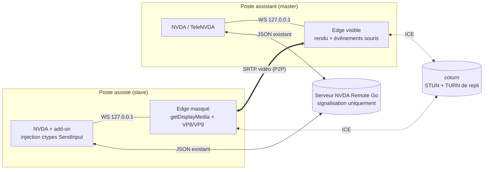
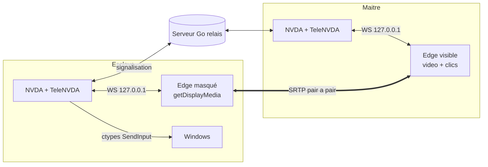

# Partage d'écran et contrôle souris via WebRTC

Étude de conception et de faisabilité pour l'ajout d'un flux vidéo d'écran et
d'un contrôle souris à NVDA Remote, en s'appuyant sur le serveur Go de ce dépôt
comme canal de signalisation.

Statut : la **signalisation serveur est implémentée** ([server/screenshare.go](server/screenshare.go))
et déployée sur l'instance de test. Le code client reste à écrire.

---

## 1. Décisions retenues

| Sujet | Choix |
|---|---|
| Architecture | WebRTC pair-à-pair, serveur en signalisation, TURN en repli |
| Découpage | Deux lots livrables indépendamment : entrées (lot 1) et vidéo (lot 2) |
| Transport des entrées | Canal NVDA Remote historique, avec bascule opportuniste sur le `DataChannel` |
| Moteur vidéo | **Microsoft Edge uniquement**, piloté par une page locale sur `127.0.0.1` |
| Qualité | Adaptative : aperçu lent (1-5 i/s) jusqu'à vidéo fluide (30 i/s) |
| Compatibilité | Négociation explicite de capacités, clients existants non impactés |
| Licences | Chaîne entièrement libre, sans brevet vidéo (VP8/VP9) |

### 1.1 Découplage entre les entrées et la vidéo

Le contrôle des entrées et la diffusion de l'écran ont été conçus ensemble dans
les premières versions de cette étude. C'était une erreur d'architecture : ces
deux fonctions n'ont ni le même volume, ni les mêmes dépendances, ni la même
difficulté.

| | Lot 1 — entrées | Lot 2 — vidéo |
|---|---|---|
| Volume | quelques dizaines d'octets par événement | 0,1 à 4 Mb/s |
| Transport | canal NVDA Remote existant | WebRTC pair à pair |
| Dépendances client | aucune, `ctypes` suffit | pile WebRTC, capture, encodeur |
| Modification serveur | **aucune** | signalisation et TURN |
| Binaire supplémentaire | non | non, Edge est déjà présent |

Deux constats justifient le découplage.

D'abord, **NVDA Remote injecte déjà des frappes clavier en Python pur**, par le
module `local_machine` du greffon, sans le moindre exécutable. Ajouter la souris
relève exactement du même mécanisme : un appel `SendInput` via `ctypes`. Rien
dans ce lot ne requiert WebRTC.

Ensuite, le lot 1 a une valeur d'usage **même sans image**. Lorsque le maître
déplace le pointeur distant, NVDA sur le poste assisté annonce ce qui se trouve
sous le curseur, et cette parole est déjà renvoyée par le canal existant. Un
utilisateur de lecteur d'écran explore donc l'écran distant à l'oreille ou en
braille, sans qu'aucun pixel ne soit transmis. Lier ce lot à la vidéo reviendrait
à retarder une fonction utile derrière la partie la plus coûteuse du projet.

Symétriquement, le lot 2 reste utile seul, en simple consultation, lorsque
l'esclave accorde la vue mais refuse le contrôle.

### 1.2 Moteur vidéo : un navigateur Chromium

Le lot 2 s'appuie sur un **navigateur Chromium déjà installé sur le poste**,
piloté par TeleNVDA à travers une page servie sur `127.0.0.1`. Microsoft Edge est
utilisé en priorité ; Google Chrome et Brave servent de repli.

Ce choix supprime purement et simplement la brique la plus coûteuse du projet :
ni capture à écrire, ni encodeur à embarquer, ni pile WebRTC à maintenir, ni
exécutable à signer et à distribuer. Le navigateur fournit `getDisplayMedia()`,
l'encodage VP8/VP9 accéléré matériellement, le transport DTLS-SRTP et l'affichage.
TeleNVDA ne conserve que la signalisation, déjà en Python, et l'injection des
entrées par `ctypes`, hors du bac à sable du navigateur.

Pourquoi Edge en premier :

- il est **installé par défaut sur Windows 10 et 11**, donc aucun téléchargement
  ni prérequis à documenter pour l'utilisateur ;
- il est mis à jour par Windows Update, donc la pile WebRTC reste corrigée sans
  action de notre part ;
- son chemin d'installation est **prévisible**, ce qui évite toute heuristique de
  détection.

Chrome et Brave sont acceptés ensuite parce qu'ils partagent le même moteur : la
page locale y fonctionne sans adaptation, et cela couvre les postes où Edge a été
retiré. Aucun autre navigateur n'est recherché, afin de garder une matrice de
test réduite, point déterminant pour un outil d'accessibilité.

Les autres pistes sont **abandonnées** :

| Piste | Motif d'abandon |
|---|---|
| Firefox | ne reconnaît pas les indicateurs de sélection automatique de source |
| `aiortc` en Python | dépend de `PyAV`/FFmpeg, encodage logiciel sous le GIL, pénalise la réactivité de la synthèse vocale |
| Exécutable natif dédié | duplique ce que le navigateur fait mieux, impose un binaire à télécharger, signer et maintenir |

Si aucun de ces navigateurs n'est installé, **le partage d'écran est simplement
indisponible** : l'option est grisée et un message l'explique. Le lot 1, les
entrées, continue de fonctionner normalement, puisqu'il ne dépend d'aucun
navigateur.

---

## 2. État actuel du serveur

Le serveur est un **relais aveugle**. Une fois le `join` effectué, tout message
est retransmis tel quel aux clients du rôle opposé, sans interprétation :

- réception et relais : [server/server.go](server/server.go#L122-L141)
- diffusion par rôle : [server/clientChannel.go](server/clientChannel.go#L256-L286)
- cadrage des messages : [server/messageconn.go](server/messageconn.go#L47-L57)

Conséquence directe : **des messages de signalisation WebRTC transiteraient déjà
sans aucune modification du serveur**. Les modifications décrites plus bas
servent à la sécurité, à la distribution des identifiants TURN et à la
négociation de capacités, pas au transport de la signalisation elle-même.

### 2.1 Limites structurelles qui interdisent le relais vidéo direct

| Limite | Emplacement | Conséquence |
|---|---|---|
| Cadrage texte par `\n`, WebSocket en `TextMessage` | [server/messageconn.go](server/messageconn.go#L47-L57) | Binaire impossible sans base64 (+33 %) |
| Ré-encodage JSON pour injecter `origin` | [server/server.go](server/server.go#L134) | Parse et réallocation de chaque trame : coût CPU rédhibitoire |
| File d'envoi de 100 messages, sans priorité | [server/client.go](server/client.go#L137) | La vidéo noierait la parole et le braille, fonctions critiques |
| Diffusion à tous les clients du rôle opposé | [server/clientChannel.go](server/clientChannel.go#L281-L286) | Bande passante multipliée par le nombre de masters |
| Un slave diffuse à tous les masters, autorisés ou non | même fonction | Fuite d'écran vers des masters non autorisés |

Ces cinq points justifient à eux seuls le choix de l'architecture WebRTC : les
médias ne transitent pas par le serveur, et la signalisation reste un volume
négligeable.

---

## 3. Architecture cible



Le serveur ne voit passer que quelques kilo-octets de SDP et de candidats ICE par
session. Les médias empruntent le chemin direct, ou le TURN en cas d'échec.

Les événements d'entrée suivent le canal NVDA Remote historique, donc le trait
`JSON existant`, et non le lien pair à pair. Ils basculent sur un `DataChannel`
entre les deux instances d'Edge lorsqu'une session vidéo est établie, cf.
section 4.4.

### 3.1 Répartition de l'effort

| Composant | Complexité | Nature |
|---|---|---|
| Serveur Go (ce dépôt) | Faible, **déjà fait** | Commandes de signalisation, TURN REST, filtrage d'autorisation |
| coturn + exploitation | Faible à moyenne | Déploiement, secret partagé, supervision |
| Page locale et pont WebSocket | Moyenne | HTML/JS de signalisation, serveur local à jeton |
| Injection d'entrées | Faible | `SendInput` par `ctypes`, conversion de coordonnées |
| Interface add-on / TeleNVDA | Moyenne | Consentement, cycle de vie d'Edge, réglages, raccourcis |
| Bureau sécurisé | Hors périmètre | Inaccessible avec ce moteur |

Le serveur Go représente la plus petite part du travail, et elle est déjà
réalisée.

---

## 4. Protocole

### 4.1 Négociation de capacités

Le serveur enregistre déjà une version de protocole par client via
`protocol_version` ([server/commands.go](server/commands.go#L71-L87)), stockée
par `SetVersion` ([server/client.go](server/client.go#L123)). On s'appuie dessus
sans casser l'existant.

Nouveau message émis par un client compatible, juste après `join` :

```json
{
  "type": "capabilities",
  "capabilities": ["screen_share/1", "input_control/1"]
}
```

Le serveur mémorise ces capacités par client et les inclut dans les blocs
`ClientData` de `client_joined` et `channel_joined`
([server/data.go](server/data.go#L19-L22)) :

```json
{ "id": 42, "connection_type": "slave", "capabilities": ["screen_share/1"] }
```

Règles de compatibilité ascendante :

- Un client qui n'envoie jamais `capabilities` est considéré sans capacité ; le
  partage d'écran ne lui est jamais proposé et aucun message de signalisation ne
  lui est relayé.
- Le champ `capabilities` est `omitempty` : la charge utile envoyée aux anciens
  clients reste strictement identique à aujourd'hui.
- Les clients NVDA Remote historiques ignorent les types de messages inconnus,
  mais le filtrage serveur évite de compter sur ce comportement.

### 4.2 Messages de signalisation

Tous portent un `target` (identifiant du client destinataire) afin que le serveur
n'utilise pas la diffusion large.

| Type | Sens | Contenu |
|---|---|---|
| `screen_share_request` | master vers slave | résolution souhaitée, mode (aperçu ou fluide), contrôle souris demandé |
| `screen_share_response` | slave vers master | acceptation ou refus, motif du refus |
| `webrtc_offer` | slave vers master | SDP d'offre |
| `webrtc_answer` | master vers slave | SDP de réponse |
| `webrtc_candidate` | bidirectionnel | candidat ICE |
| `screen_share_stop` | bidirectionnel | fin de session, motif |

L'offre part du **slave**, car c'est lui qui produit le flux et qui doit garder
la maîtrise du consentement.

### 4.3 Identifiants TURN éphémères

Nouvelle commande serveur, traitée avant même le `join` n'est pas souhaitable :
elle doit exiger un client authentifié et présent dans un canal.

Requête :

```json
{ "type": "turn_credentials" }
```

Réponse, selon le mécanisme REST TURN (`username = <expiration>:<user_id>`,
`credential = base64(HMAC-SHA1(secret, username))`) :

```json
{
  "type": "turn_credentials",
  "ice_servers": [
    { "urls": ["stun:turn.exemple.fr:3478"] },
    {
      "urls": ["turn:turn.exemple.fr:3478?transport=udp",
               "turns:turn.exemple.fr:5349?transport=tcp"],
      "username": "1789456000:42",
      "credential": "wS8kQ...="
    }
  ],
  "ttl": 3600
}
```

Le secret partagé n'est jamais transmis au client. Les identifiants expirent, ce
qui empêche l'usage du TURN comme relais ouvert.

### 4.4 Transport des événements d'entrée

Les événements de souris et de clavier empruntent **deux chemins possibles, avec
une charge utile strictement identique** :

| Chemin | Disponibilité | Latence typique | Usage |
|---|---|---|---|
| Canal NVDA Remote historique, message `mouse` | toujours | 50 à 150 ms (aller-retour serveur) | chemin par défaut et repli |
| `RTCDataChannel` nommé `input` | seulement si une session vidéo est établie | 10 à 30 ms (pair à pair) | pointage fin |

Règle d'implémentation : **si le `DataChannel` est ouvert, l'utiliser ; sinon,
retomber sur le canal historique**, sans que l'utilisateur ait à le savoir. Cette
bascule est indispensable, car le cas où WebRTC échoue — NAT symétrique sans
TURN joignable — est précisément celui où l'on veut conserver au moins le
contrôle.

Sur le canal historique, le message est encapsulé dans le protocole existant :

```json
{ "type": "mouse", "t": "md", "x": 0.4312, "y": 0.7788, "b": 0 }
```

Le serveur étant un relais aveugle, ce type transite sans aucune modification de
code serveur. Il reste protégé par la capacité `input_control/1`, déjà définie
dans [server/screenshare.go](server/screenshare.go), et par le consentement
explicite de l'esclave.

Les coordonnées sont **normalisées** en flottants `[0,1]` par rapport à l'écran
partagé, pour être indépendantes de la résolution et du facteur DPI. Le format
canonique des champs (`m`, `md`, `mu`, `w`, `kd`, `ku`) est décrit une seule fois,
dans [docs/signalisation-webrtc-client.md](docs/signalisation-webrtc-client.md) ;
ce document fait foi en cas de divergence.

L'esclave applique les événements avec `SendInput`, après conversion vers les
coordonnées absolues du bureau virtuel. Le sens est **toujours du maître vers
l'esclave** : l'esclave n'envoie jamais d'événement d'entrée.

---

## 5. Chiffrage de la bande passante

### 5.1 Débits par session

Contenu d'écran encodé en VP9 (outils de codage adaptés au contenu synthétique) :

| Mode | Résolution | Cadence | Débit typique |
|---|---|---|---|
| Aperçu statique | 1920x1080 | 1-2 i/s | 60 à 200 kb/s |
| Aperçu réactif | 1920x1080 | 5 i/s | 150 à 400 kb/s |
| Assistance courante | 1920x1080 | 15 i/s | 800 kb/s à 1,5 Mb/s |
| Fluide, contenu animé | 1920x1080 | 30 i/s | 2 à 4 Mb/s |

À titre de comparaison, le trafic actuel de NVDA Remote (parole, braille,
frappes) se situe autour de **1 à 5 kb/s**. Un flux d'assistance courant
représente donc environ **300 à 800 fois** le trafic actuel par session.

### 5.2 Coût pour le serveur en architecture WebRTC

**Signalisation** : environ 4 à 12 ko de SDP et de candidats ICE par session
établie, plus quelques centaines d'octets de renégociation. Négligeable, y
compris à plusieurs milliers de sessions par jour.

**TURN** : seules les sessions qui échouent en P2P transitent par le relais. Les
taux observés en pratique sur un parc grand public se situent entre **10 et 30 %**
de sessions relayées, la fourchette haute correspondant aux réseaux d'entreprise
avec pare-feu symétrique.

Volume relayé, pour une session à 2 Mb/s :

- 2 Mb/s égale 0,25 Mo/s, soit environ **0,9 Go par heure** dans un sens.
- Le TURN reçoit puis réémet : **0,9 Go/h d'entrée et 0,9 Go/h de sortie**. Chez
  la plupart des hébergeurs, seule la sortie est facturée.

Projections, avec 20 % de sessions relayées à 2 Mb/s :

| Sessions simultanées | Sessions relayées | Débit crête sortant | Volume sortant pour 1 h |
|---|---|---|---|
| 10 | 2 | 4 Mb/s | 1,8 Go |
| 50 | 10 | 20 Mb/s | 9 Go |
| 100 | 20 | 40 Mb/s | 18 Go |
| 500 | 100 | 200 Mb/s | 90 Go |

Conclusion pratique : jusqu'à une centaine de sessions simultanées, un VPS
disposant d'un lien à 1 Gb/s et d'un forfait de trafic généreux suffit. Au-delà,
le poste de coût dominant devient le volume mensuel, pas le CPU : le TURN ne fait
que recopier des paquets chiffrés, il ne décode rien.

### 5.3 Ce qu'aurait coûté un relais serveur classique

Sans P2P, **100 %** des sessions transiteraient par le serveur, et la diffusion
vers plusieurs masters multiplierait encore le volume. À 100 sessions
simultanées, on passerait de 40 Mb/s à **200 Mb/s ou davantage** en continu, avec
en prime la contention sur la file d'envoi de 100 messages
([server/client.go](server/client.go#L137)) qui dégraderait la latence de la
synthèse vocale. C'est l'argument décisif en faveur du WebRTC.

### 5.4 Leviers de réduction

- Cadence adaptative pilotée par le contenu : rester à 1-2 i/s tant que l'écran
  ne change pas, monter en cadence uniquement sur activité.
- Encodage par régions modifiées plutôt que trames complètes.
- Réduction d'échelle côté source quand la fenêtre d'affichage du master est plus
  petite que l'écran distant.
- Indice de contenu `detail` de WebRTC, qui privilégie la netteté du texte au
  détriment de la cadence.
- Politique optionnelle « TURN seulement » réservée aux contextes où masquer les
  adresses IP locales prime sur le coût.

---

## 6. Modifications à apporter au serveur Go

Périmètre volontairement réduit et sans rupture.

### 6.1 Configuration

Nouveaux champs dans `Cfg` ([server/cfg.go](server/cfg.go#L11-L24)), avec
constantes correspondantes dans [server/defaults.go](server/defaults.go) et prise
en compte dans `cfg_default` et `IsDefault` :

```go
ScreenShare       bool     `json:"screen_share"`
TurnUrls          []string `json:"turn_urls"`
TurnSecret        string   `json:"turn_secret"`
TurnTtl           int      `json:"turn_ttl"`
ScreenShareMaster bool     `json:"screen_share_require_authorized_master"`
```

Le partage d'écran doit être **désactivé par défaut**, pour que les serveurs
existants ne changent pas de comportement après mise à jour.

### 6.2 Nouvelles commandes

Dans [server/commands.go](server/commands.go) :

- `capabilities` : enregistre les capacités du client, avec liste blanche des
  valeurs acceptées et plafond de taille.
- `turn_credentials` : refuse si `ScreenShare` est faux, si le client n'a pas
  rejoint de canal, ou si le client est un master non autorisé ; sinon calcule
  les identifiants HMAC éphémères.

### 6.3 Relais ciblé

Aujourd'hui, `MessageReceived` relaie tout à tous
([server/server.go](server/server.go#L122-L141)). Il faut intercepter les types
de signalisation **avant** ce relais, et les router vers le seul destinataire
`target`, avec les contrôles suivants :

- le destinataire appartient au même canal ;
- l'émetteur et le destinataire annoncent la capacité `screen_share/1` ;
- si l'émetteur est un master, il doit être autorisé (`GetAuthorized`), sans quoi
  la demande est rejetée ;
- si l'émetteur est un slave, le flux ne part que vers le master qui a émis la
  demande acceptée, jamais en diffusion.

C'est le point de sécurité le plus important de toute la conception : la
diffusion actuelle du sens slave vers master ne filtre pas l'autorisation, et
appliquer ce comportement à un flux d'écran exposerait le bureau de l'utilisateur
à tout master connecté au canal.

### 6.4 Limitation de débit

Un compteur simple par client sur les messages de signalisation, afin qu'un
client malveillant ne puisse pas inonder un pair via `webrtc_candidate`.

### 6.5 Journalisation et administration

Ajout d'événements au journal de canal pour l'ouverture et la fermeture d'une
session de partage, et exposition du nombre de sessions actives dans les routes
d'administration existantes ([server/admin.go](server/admin.go)).

---

## 7. Moteur vidéo : un navigateur Chromium

### 7.1 Principe

TeleNVDA héberge un petit serveur HTTP et WebSocket sur `127.0.0.1`, sert une
page locale, et lance Edge sur cette page. La page fait tout le
travail média ; TeleNVDA ne fait que relayer la signalisation entre cette page et
le serveur NVDA Remote.



Le navigateur est nécessaire **des deux côtés** : c'est lui qui capture chez
l'esclave et qui décode chez le maître. La différence est sa visibilité.

| | Esclave | Maître |
|---|---|---|
| Rôle | capture et émission | réception et affichage |
| Fenêtre | masquée, hors écran | visible, c'est l'interface |
| Interaction | aucune après démarrage | clics et frappes capturés |

`http://127.0.0.1` est un **contexte sécurisé** au sens des navigateurs :
`getDisplayMedia()` y est autorisé sans certificat TLS.

### 7.2 Détection du navigateur

Les candidats sont essayés dans l'ordre `msedge.exe`, `chrome.exe`, puis
`brave.exe`. Pour chacun, ordre de recherche, du plus fiable au moins fiable :

1. Clé de registre
   `HKLM\SOFTWARE\Microsoft\Windows\CurrentVersion\App Paths\<executable>`,
   valeur par défaut, puis la même clé sous `HKCU`. C'est la source faisant
   autorité sous Windows.
2. Chemins d'installation habituels, sous `%ProgramFiles(x86)%`,
   `%ProgramFiles%` puis `%LocalAppData%`.

Ne **jamais** se contenter d'invoquer `msedge` en s'en remettant au `PATH` : la
variable peut être détournée par un exécutable arbitraire placé dans un dossier
prioritaire, ce qui reviendrait à lancer un programme quelconque avec les droits
de l'utilisateur. Toujours partir d'un chemin absolu vérifié.

Si aucun chemin n'aboutit, TeleNVDA **ne déclare pas** la capacité
`screen_share/1`. Le pair distant grise alors l'option de lui-même, sans
traitement particulier : c'est exactement le comportement prévu par le protocole.

### 7.3 Fenêtre discrète côté esclave

L'exigence est double : ne pas déranger l'utilisateur assisté, et ne pas polluer
l'image transmise.

Lancement dans un **profil dédié et jetable**, jamais le profil habituel de
l'utilisateur :

```
<chemin absolu résolu en 7.2>\msedge.exe
           --app=http://127.0.0.1:<port>/s?k=<jeton>
           --user-data-dir=<dossier temporaire dédié>
           --window-position=-32000,-32000
           --window-size=320,240
           --no-first-run --no-default-browser-check --disable-extensions
           --use-fake-ui-for-media-stream
           --disable-background-timer-throttling
           --disable-backgrounding-occluded-windows
           --disable-renderer-backgrounding
```

| Option | Effet |
|---|---|
| `--app=` | fenêtre sans barre d'adresse ni onglets |
| `--user-data-dir=` | profil isolé ; aucune donnée de navigation de l'utilisateur n'est accessible à la page |
| `--window-position=-32000,-32000` | fenêtre positionnée hors du bureau virtuel |
| `--use-fake-ui-for-media-stream` | supprime le sélecteur de source, cf. 7.4 |
| `--disable-*-throttling`, `--disable-*-backgrounding` | stabilisent la cadence, cf. mesures ci-dessous |

Le placement **hors écran est préférable à la simple réduction**, pour deux
raisons : une fenêtre réduite peut être restaurée par erreur, et surtout une
fenêtre visible affichant le flux se capturerait elle-même, produisant l'effet de
miroir infini.

**Le mode `headless` est inutilisable.** Sans bureau attaché, il n'y a pas
d'écran à capturer. La fenêtre doit exister, seulement être invisible.

#### Mesures, Edge 151.0.4129.72

Le bridage des fenêtres en arrière-plan était le principal doute sur cette
approche. Il est levé : une fenêtre positionnée à `-32000,-32000` **n'est pas
bridée**.

| Configuration | Cadence émise | Dérive du minuteur | Gels |
|---|---|---|---|
| Fenêtre visible, drapeaux anti-bridage | 15 img/s | 1 ms | 0 |
| Fenêtre hors écran, drapeaux anti-bridage | 15,2 img/s | -15 ms | 0 |
| Fenêtre hors écran, sans ces drapeaux | 14,1 img/s | -9 ms | 2, soit 1,5 s |

Mesures sur 14 à 18 secondes, source 1920x1200 à 15 img/s demandées, environ
530 kbit/s. La dérive du minuteur est l'écart entre deux réveils d'un intervalle
d'une seconde dans la page émettrice : c'est ce qui trahirait un rendu bridé.

Les drapeaux anti-bridage restent donc nécessaires, non pour la cadence moyenne,
mais pour supprimer les gels.

Protocole de mesure reproductible : [prototype/edge-capture/maquette.py](prototype/edge-capture/maquette.py).

### 7.4 Sélecteur de source d'écran

C'est la seule friction réelle de cette approche. `getDisplayMedia()` impose
normalement une boîte de dialogue de choix de source, déclenchée par un geste
utilisateur. Cette boîte est inutilisable dans notre cas : elle s'ouvrirait sur
le poste assisté, dans une fenêtre placée hors écran, devant un utilisateur qui
ne peut ni la voir ni l'atteindre.

#### Ce qui a été mesuré

**`--auto-select-desktop-capture-source` ne fonctionne pas.** Neuf titres de
source ont été essayés sur Edge 151, en anglais comme en français, `Entire
screen`, `Entire Screen`, `Screen 1`, `Ecran entier`, `Écran entier`, `Tout
l'écran`, `Écran 1`, `Ecran 1`, `Bureau 1` : dans tous les cas la boîte de
dialogue s'est ouverte et `getDisplayMedia()` n'a jamais rendu la main. Cet
indicateur est donc écarté, contrairement à ce qui était supposé.

**`--use-fake-ui-for-media-stream` fonctionne.** Le sélecteur disparaît et le
flux est obtenu en 700 à 1000 ms, sans aucune interaction, fenêtre visible comme
hors écran.

#### Contrepartie de sécurité, et pourquoi elle est acceptable

Ce drapeau n'accorde pas seulement l'écran : il accorde **toutes** les
permissions média sans rien demander, microphone et caméra compris. Il ne serait
pas acceptable dans un navigateur ordinaire.

Il l'est ici parce que le processus lancé n'a rien d'un navigateur ordinaire :

- il tourne sur un **profil temporaire**, créé pour la session et supprimé
  ensuite, sans historique, sans mot de passe enregistré, sans extension ;
- il ne charge **qu'une seule page**, servie par TeleNVDA sur `127.0.0.1`,
  derrière un jeton de 256 bits, avec vérification de l'en-tête `Origin` ;
- cette page ne demande jamais ni micro ni caméra ; la permission élargie porte
  donc sur des capacités qu'aucun code ne sollicite ;
- il est terminé à la fin de la session.

La surface réelle se réduit à cette page. Le drapeau ne doit jamais être passé à
une instance d'Edge susceptible de charger autre chose, ni au profil habituel de
l'utilisateur.

#### Le consentement reste demandé

Supprimer le dialogue du navigateur n'est légitime que parce que **le
consentement réel est demandé par TeleNVDA lui-même**, par une boîte de dialogue
accessible, avant tout lancement du navigateur. Le dialogue du navigateur n'est
pas accessible dans les mêmes termes à un utilisateur de lecteur d'écran ; le
supprimer sans le remplacer serait inacceptable. C'est le lot 2, phase 6.

#### Repli

Si une version future d'Edge retirait ce drapeau, le repli reste la voie manuelle :
la page affiche un unique bouton, focalisé d'emblée, et la fenêtre est amenée au
premier plan le temps du consentement, puis renvoyée hors écran. Les stratégies
d'entreprise `ScreenCaptureAllowedByOrigins` et
`ScreenCaptureWithoutGestureAllowedForOrigins` conviennent aux parcs gérés, mais
ne dispensent pas du choix de la source.

#### Point non mesuré

Le comportement en **multi-écrans** reste à vérifier : la fausse interface
sélectionne une source par défaut, mais laquelle exactement lorsqu'il y en a
plusieurs n'a pas été observé. La mesure a été faite sur un écran unique.

### 7.5 Sécurité du pont local

Point de vigilance principal de toute cette approche : **n'importe quelle page
ouverte dans le navigateur de l'utilisateur peut tenter de se connecter à
`ws://127.0.0.1`**. Sans protection, un site malveillant pilote la souris du
poste.

Mesures obligatoires :

| Exigence | Mise en œuvre |
|---|---|
| Écoute restreinte | liaison sur `127.0.0.1` uniquement, jamais `0.0.0.0` |
| Port éphémère | port 0, attribué par le système à chaque session |
| Jeton | 256 bits aléatoires, exigé sur la WebSocket comme sur chaque requête HTTP |
| Vérification d'origine | rejet de tout en-tête `Origin` ne correspondant pas à l'origine locale attendue |
| Durée de vie | serveur démarré à l'ouverture de session, arrêté dès la fin |
| Comparaison du jeton | comparaison à temps constant, pour éviter une attaque temporelle |
| Nettoyage | arborescence de processus du navigateur terminée et profil temporaire supprimé à la fin |

Le jeton transite dans l'URL passée au navigateur. Il est donc visible dans la
ligne de commande du processus. Comme il n'est valable que le temps d'une session
et ne donne accès qu'à une session déjà consentie, le risque est accepté ; il
devra néanmoins être réévalué si le pont local gagne des fonctions.

### 7.6 Réglages média dans la page

- `contentHint = "text"` ou `"detail"` sur la piste vidéo : privilégie la netteté
  du texte sur la fluidité. C'est le bon compromis ici.
- Plafonner par `applyConstraints` à 1920 × 1080 et à la cadence du profil
  choisi.
- Ordonner les codecs par `setCodecPreferences` : VP9 puis VP8. Ne jamais
  retirer VP8, repli universel.
- Ne jamais demander l'audio : `getDisplayMedia({ video: true, audio: false })`.
- Surveiller `track.onended`, qui signale l'arrêt du partage par l'utilisateur ou
  par le système, et émettre alors `screen_share_stop`.

### 7.7 Limites assumées

| Limite | Conséquence |
|---|---|
| Nécessite Edge | présent par défaut sous Windows 10 et 11 ; s'il est absent, la capacité `screen_share/1` n'est pas déclarée et l'option est grisée chez le pair |
| Aucun autre navigateur | Chrome, Firefox et les autres ne sont pas pris en charge, même s'ils sont installés |
| Bureau sécurisé hors de portée | un navigateur en session utilisateur ne capture ni l'écran de verrouillage ni les invites UAC, cf. section 8.2 |
| Barre de notification de partage | Edge peut afficher un bandeau indiquant le partage en cours ; il est visible dans l'image transmise |
| Processus supplémentaire | consommation mémoire d'une instance d'Edge pendant la session |

La limite du bureau sécurisé est structurelle et ne pourra pas être levée avec ce
moteur. Elle est acceptée : le périmètre retenu est la session utilisateur.

### 7.8 Codecs
- **VP8** : obligatoire dans WebRTC, libre de redevance, licence BSD via libvpx.
  Repli universel.
- **VP9** : outils de codage de contenu d'écran, nettement supérieur sur du texte
  à débit égal. À préférer quand les deux pairs le prennent en charge.
- **AV1** : meilleure compression encore, mais coût d'encodage encore trop élevé
  sur un poste bureautique ordinaire.
- **H.264 : à écarter**, en raison des redevances MPEG LA, incompatibles avec une
  distribution libre.

### 7.9 Qualité adaptative

WebRTC fournit nativement le contrôle de congestion (GCC, retours TWCC), ce qui
couvre l'essentiel du besoin d'adaptation. S'y ajoute une logique applicative :

- profils utilisateur explicites (aperçu, équilibré, fluide), appliqués par
  `applyConstraints` et par `RTCRtpSender.setParameters` ;
- réduction automatique de résolution quand le débit disponible s'effondre, la
  lisibilité du texte primant sur la fluidité ;
- réduction d'échelle côté source par `scaleResolutionDownBy` quand la fenêtre
  d'affichage du maître est plus petite que l'écran distant.

---

## 8. Contrôle souris et bureau sécurisé

### 8.1 Session utilisateur

Injection via `SendInput` avec le drapeau `MOUSEEVENTF_ABSOLUTE`, coordonnées
converties depuis les valeurs normalisées vers le rectangle du bureau virtuel.
Prise en charge du multi-écrans et des facteurs DPI hétérogènes via
l'API par moniteur.

### 8.2 Bureau sécurisé — hors périmètre

Le choix d'Edge comme moteur unique **exclut définitivement** le bureau sécurisé
du périmètre. C'est le prix assumé de la simplicité.

Contraintes :

- L'écran de connexion et les invites UAC vivent sur le bureau **Winlogon**,
  distinct du bureau interactif par défaut. Un processus ne peut interagir
  qu'avec le bureau auquel il est attaché.
- Edge s'exécute dans la session interactive de l'utilisateur : il ne capture ni
  l'écran de verrouillage, ni les invites UAC, et **ne peut pas** être attaché au
  bureau Winlogon.
- `SendInput` est également refusé sur le bureau sécurisé, ainsi que vers toute
  fenêtre plus privilégiée que le processus émetteur (UIPI).

Comportement attendu, à défaut de prise en charge :

- détecter le basculement de bureau, par exemple avec `OpenInputDesktop` ;
- **suspendre** l'affichage côté maître et indiquer explicitement « bureau
  sécurisé, image suspendue » ;
- ne **jamais** laisser la dernière image affichée, l'assistant croirait voir
  l'état réel du poste ;
- reprendre automatiquement au retour dans la session utilisateur.

La prise en charge du bureau sécurisé supposerait un service natif sous le compte
SYSTEM, donc exactement l'exécutable dédié que ce choix d'architecture écarte. Ce
serait un projet distinct, à auditer séparément : un défaut y offrirait un
contrôle distant de l'écran de connexion.

---

## 9. Sécurité

| Risque | Mesure |
|---|---|
| Écran diffusé à un master non autorisé | Routage ciblé par `target` et contrôle d'autorisation explicite, cf. section 6.3 |
| Partage démarré à l'insu de l'utilisateur | Consentement explicite obligatoire côté slave, jamais mémorisable en silence |
| Utilisateur non voyant ignorant qu'il est observé | Signal sonore périodique et annonce vocale à l'ouverture et à la fermeture, non désactivables |
| Impossibilité d'arrêter le partage | Raccourci global d'arrêt d'urgence, prioritaire sur toute autre action |
| TURN utilisé comme relais ouvert | Identifiants éphémères HMAC à TTL courte, jamais de compte statique |
| Fuite d'adresses IP privées via ICE | Option de politique `relay` forçant le passage par TURN |
| Interception du flux | DTLS-SRTP, natif et obligatoire en WebRTC |
| Injection d'entrées non sollicitée | Le contrôle n'est actif que s'il a été explicitement accordé ; à la révocation, l'esclave cesse d'appliquer les événements et le `DataChannel` est refermé |
| Page web tierce pilotant le pont local | Écoute sur `127.0.0.1` seulement, jeton de 256 bits, vérification stricte de l'en-tête `Origin`, cf. section 7.5 |
| Edge remplacé par un exécutable arbitraire | Résolution du chemin par le registre, jamais par le `PATH`, cf. section 7.2 |
| Fuite de données du profil de navigation | Profil temporaire dédié via `--user-data-dir`, supprimé en fin de session |
| Inondation de signalisation | Limitation de débit par client, cf. section 6.4 |

Un point mérite d'être souligné auprès des décideurs : ajouter du contrôle
souris et de la vidéo transforme la nature du produit. NVDA Remote reste
aujourd'hui limité à la sortie vocale et braille ; l'outil deviendrait un outil
de prise en main complète, avec le profil de risque associé. Une revue de
sécurité indépendante avant mise en production est fortement conseillée.

---

## 10. Licences

| Composant | Licence | Compatible NVDA (GPLv2) |
|---|---|---|
| Microsoft Edge | Propriétaire, préinstallé | Oui : dépendance externe au système, aucun code lié ni redistribué |
| Page locale et pont WebSocket | Écrits pour ce projet | Oui |
| libvpx (VP8/VP9), embarqué dans Edge | BSD | Oui |
| coturn | BSD-3 | Oui |
| `pion/webrtc` (repli documenté) | MIT | Oui |
| `aiortc` (écarté) | BSD-3 | Oui |
| UltraVNC, TigerVNC, x11vnc | GPLv2 | Oui pour NVDA, mais exclut toute réutilisation propriétaire |
| H.264 / MPEG LA | Brevets | À écarter |

L'ensemble de la pile recommandée est donc compatible avec une distribution
libre, y compris si une variante propriétaire devait être envisagée un jour, ce
que l'option VNC aurait interdit.

Le recours à Edge ne pose pas de difficulté de licence : il s'agit d'un logiciel
déjà présent sur le système, invoqué comme une application externe. Rien n'en est
redistribué avec le greffon, et aucun lien de code n'est établi.

---

## 11. Pourquoi pas UltraVNC

La demande initiale évoquait UltraVNC. L'option a été écartée pour les raisons
suivantes :

- Le protocole RFB n'a pas de contrôle de congestion comparable à WebRTC ; la
  qualité adaptative demandée serait à réimplémenter.
- UltraVNC impose l'installation d'un service Windows privilégié, avec les
  contraintes de déploiement et de sécurité associées, alors que les utilisateurs
  de NVDA Remote installent aujourd'hui un simple add-on.
- Le relais RFB devrait transiter par le serveur, ce qui ramène tout le coût de
  bande passante décrit en section 5.3.
- La licence GPLv2 verrouille les usages futurs.
- Le projet est peu actif, et sa base de code est ancienne.

Ce qui reste vrai de l'idée d'origine : la capture d'écran et l'injection
d'entrées, techniques éprouvées par VNC, sont exactement ce qu'il faut faire.
Dans l'architecture retenue, la capture est déléguée à Edge et l'injection reste
en Python : il n'y a donc rien à réécrire de ce côté.

---

## 12. Phasage proposé

| Phase | Lot | Contenu | Livrable vérifiable |
|---|---|---|---|
| 0 | — | Spécification du protocole, revue de sécurité de conception | Ce document, amendé et validé |
| 1 | — | Serveur Go : capacités, routage ciblé, TURN REST, configuration, tests | **Fait**, `go test ./...` vert, serveur rétrocompatible |
| 2 | 1 | Injection souris par `ctypes`, message `mouse` sur le canal historique, consentement | **Fait**, le pointeur distant suit le pointeur local, NVDA annonce ce qu'il survole |
| 3 | 1 | Clavier étendu, molette, multi-écrans et DPI mixte | Aucun décalage sur configuration hétérogène |
| 4 | 2 | Détection d'Edge, pont local à jeton, page de signalisation | **Écrit**, reste à éprouver entre deux postes réels |
| 5 | 2 | Fenêtre discrète côté esclave, sélection de source, cycle de vie et nettoyage | Aucune fenêtre parasite, profil temporaire supprimé |
| 6 | 2 | Interface : consentement, indicateur permanent, arrêt d'urgence | Parcours utilisateur complet |
| 7 | 2 | Déploiement coturn et validation sous NAT symétrique | Session établie via relais, taux de repli mesuré |
| 8 | 2 | Bascule des entrées sur le `DataChannel`, qualité adaptative, statistiques | Latence réduite, métriques exposées |

Le lot 1, phases 2 et 3, est **livrable seul** : il ne dépend ni d'Edge, ni de
coturn, ni de WebRTC, et fonctionne déjà contre le serveur de production actuel.
C'est le point de départ recommandé.

---

## 13. Points ouverts à trancher

1. Le partage d'écran doit-il être activable par canal ou uniquement au niveau du
   serveur entier ?
2. Faut-il journaliser les sessions de partage à des fins de traçabilité, et
   pendant combien de temps, au regard du RGPD ?
3. L'infrastructure TURN sera-t-elle hébergée sur le même serveur que
   `nvdaremote.accessolutions.fr`, ou sur une machine dédiée ? La seconde option
   est préférable pour isoler les pics de trafic.
4. Quelle version minimale d'Edge exiger, et comment la vérifier avant de
   déclarer la capacité `screen_share/1` ? La maquette a été validée sur
   151.0.4129.72.
5. `--use-fake-ui-for-media-stream` accorde toutes les permissions média au
   profil temporaire, cf. 7.4. Le confinement décrit y est-il jugé suffisant,
   ou faut-il exiger en plus les stratégies d'entreprise sur les parcs gérés ?
6. Quelle source la fausse interface sélectionne-t-elle sur un poste
   **multi-écrans** ? Non observé, la mesure ayant été faite sur un écran unique.
7. Souhaite-t-on également transporter l'audio du poste distant sur la même
   session, ou s'en tenir à la vidéo ?
