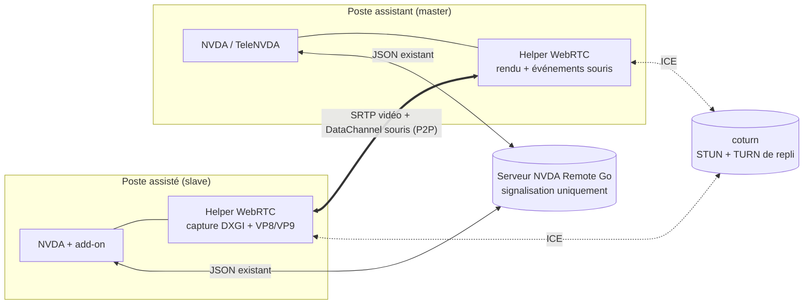

# Partage d'écran et contrôle souris via WebRTC

Étude de conception et de faisabilité pour l'ajout d'un flux vidéo d'écran et
d'un contrôle souris à NVDA Remote, en s'appuyant sur le serveur Go de ce dépôt
comme canal de signalisation.

Statut : proposition de conception. Aucun code de cette étude n'est encore
implémenté.

---

## 1. Décisions retenues

| Sujet | Choix |
|---|---|
| Architecture | WebRTC pair-à-pair, serveur en signalisation, TURN en repli |
| Qualité | Adaptative : aperçu lent (1-5 i/s) jusqu'à vidéo fluide (30 i/s) |
| Compatibilité | Négociation explicite de capacités, clients existants non impactés |
| Souris | Contrôle complet, bureau sécurisé Windows inclus |
| Licences | Chaîne entièrement libre, sans brevet vidéo (VP8/VP9) |

---

## 2. État actuel du serveur

Le serveur est un **relais aveugle**. Une fois le `join` effectué, tout message
est retransmis tel quel aux clients du rôle opposé, sans interprétation :

- réception et relais : [server/server.go](server/server.go#L122-L141)
- diffusion par rôle : [server/clientChannel.go](server/clientChannel.go#L256-L286)
- cadrage des messages : [server/messageconn.go](server/messageconn.go#L47-L57)

Conséquence directe : **des messages de signalisation WebRTC transiteraient déjà
sans aucune modification du serveur**. Les modifications décrites plus bas
servent à la sécurité, à la distribution des identifiants TURN et à la
négociation de capacités, pas au transport de la signalisation elle-même.

### 2.1 Limites structurelles qui interdisent le relais vidéo direct

| Limite | Emplacement | Conséquence |
|---|---|---|
| Cadrage texte par `\n`, WebSocket en `TextMessage` | [server/messageconn.go](server/messageconn.go#L47-L57) | Binaire impossible sans base64 (+33 %) |
| Ré-encodage JSON pour injecter `origin` | [server/server.go](server/server.go#L134) | Parse et réallocation de chaque trame : coût CPU rédhibitoire |
| File d'envoi de 100 messages, sans priorité | [server/client.go](server/client.go#L137) | La vidéo noierait la parole et le braille, fonctions critiques |
| Diffusion à tous les clients du rôle opposé | [server/clientChannel.go](server/clientChannel.go#L281-L286) | Bande passante multipliée par le nombre de masters |
| Un slave diffuse à tous les masters, autorisés ou non | même fonction | Fuite d'écran vers des masters non autorisés |

Ces cinq points justifient à eux seuls le choix de l'architecture WebRTC : les
médias ne transitent pas par le serveur, et la signalisation reste un volume
négligeable.

---

## 3. Architecture cible



Le serveur ne voit passer que quelques kilo-octets de SDP et de candidats ICE par
session. Les médias empruntent le chemin direct, ou le TURN en cas d'échec.

### 3.1 Répartition de l'effort

| Composant | Complexité | Nature |
|---|---|---|
| Serveur Go (ce dépôt) | Faible | Commandes de signalisation, TURN REST, filtrage d'autorisation |
| coturn + exploitation | Faible à moyenne | Déploiement, secret partagé, supervision |
| Helper WebRTC | Élevée | Capture, encodage, transport, injection d'entrées |
| Interface add-on / TeleNVDA | Moyenne | Consentement, fenêtre vidéo, réglages, raccourcis |
| Bureau sécurisé | Élevée | Contexte SYSTEM, desktop Winlogon, cycle de vie |

Le serveur Go représente la plus petite part du travail.

---

## 4. Protocole

### 4.1 Négociation de capacités

Le serveur enregistre déjà une version de protocole par client via
`protocol_version` ([server/commands.go](server/commands.go#L71-L87)), stockée
par `SetVersion` ([server/client.go](server/client.go#L123)). On s'appuie dessus
sans casser l'existant.

Nouveau message émis par un client compatible, juste après `join` :

```json
{
  "type": "capabilities",
  "capabilities": ["screen_share/1", "input_control/1"]
}
```

Le serveur mémorise ces capacités par client et les inclut dans les blocs
`ClientData` de `client_joined` et `channel_joined`
([server/data.go](server/data.go#L19-L22)) :

```json
{ "id": 42, "connection_type": "slave", "capabilities": ["screen_share/1"] }
```

Règles de compatibilité ascendante :

- Un client qui n'envoie jamais `capabilities` est considéré sans capacité ; le
  partage d'écran ne lui est jamais proposé et aucun message de signalisation ne
  lui est relayé.
- Le champ `capabilities` est `omitempty` : la charge utile envoyée aux anciens
  clients reste strictement identique à aujourd'hui.
- Les clients NVDA Remote historiques ignorent les types de messages inconnus,
  mais le filtrage serveur évite de compter sur ce comportement.

### 4.2 Messages de signalisation

Tous portent un `target` (identifiant du client destinataire) afin que le serveur
n'utilise pas la diffusion large.

| Type | Sens | Contenu |
|---|---|---|
| `screen_share_request` | master vers slave | résolution souhaitée, mode (aperçu ou fluide), contrôle souris demandé |
| `screen_share_response` | slave vers master | acceptation ou refus, motif du refus |
| `webrtc_offer` | slave vers master | SDP d'offre |
| `webrtc_answer` | master vers slave | SDP de réponse |
| `webrtc_candidate` | bidirectionnel | candidat ICE |
| `screen_share_stop` | bidirectionnel | fin de session, motif |

L'offre part du **slave**, car c'est lui qui produit le flux et qui doit garder
la maîtrise du consentement.

### 4.3 Identifiants TURN éphémères

Nouvelle commande serveur, traitée avant même le `join` n'est pas souhaitable :
elle doit exiger un client authentifié et présent dans un canal.

Requête :

```json
{ "type": "turn_credentials" }
```

Réponse, selon le mécanisme REST TURN (`username = <expiration>:<user_id>`,
`credential = base64(HMAC-SHA1(secret, username))`) :

```json
{
  "type": "turn_credentials",
  "ice_servers": [
    { "urls": ["stun:turn.exemple.fr:3478"] },
    {
      "urls": ["turn:turn.exemple.fr:3478?transport=udp",
               "turns:turn.exemple.fr:5349?transport=tcp"],
      "username": "1789456000:42",
      "credential": "wS8kQ...="
    }
  ],
  "ttl": 3600
}
```

Le secret partagé n'est jamais transmis au client. Les identifiants expirent, ce
qui empêche l'usage du TURN comme relais ouvert.

### 4.4 Canal de données pour la souris et le clavier

Un `RTCDataChannel` fiable et ordonné, séparé du flux vidéo, transporte les
événements d'entrée. Format compact, coordonnées **normalisées** en flottants
`[0,1]` pour être indépendantes de la résolution et du facteur DPI :

```json
{ "t": "m", "x": 0.4312, "y": 0.7788, "s": 0 }
{ "t": "md", "b": "left" }
{ "t": "mu", "b": "left" }
{ "t": "w", "d": -120, "h": false }
{ "t": "kd", "vk": 65, "ext": false }
```

Le champ `s` désigne l'index de l'écran en configuration multi-moniteurs. Le
slave applique les événements avec `SendInput`, après conversion en coordonnées
absolues de l'écran ciblé.

---

## 5. Chiffrage de la bande passante

### 5.1 Débits par session

Contenu d'écran encodé en VP9 (outils de codage adaptés au contenu synthétique) :

| Mode | Résolution | Cadence | Débit typique |
|---|---|---|---|
| Aperçu statique | 1920x1080 | 1-2 i/s | 60 à 200 kb/s |
| Aperçu réactif | 1920x1080 | 5 i/s | 150 à 400 kb/s |
| Assistance courante | 1920x1080 | 15 i/s | 800 kb/s à 1,5 Mb/s |
| Fluide, contenu animé | 1920x1080 | 30 i/s | 2 à 4 Mb/s |

À titre de comparaison, le trafic actuel de NVDA Remote (parole, braille,
frappes) se situe autour de **1 à 5 kb/s**. Un flux d'assistance courant
représente donc environ **300 à 800 fois** le trafic actuel par session.

### 5.2 Coût pour le serveur en architecture WebRTC

**Signalisation** : environ 4 à 12 ko de SDP et de candidats ICE par session
établie, plus quelques centaines d'octets de renégociation. Négligeable, y
compris à plusieurs milliers de sessions par jour.

**TURN** : seules les sessions qui échouent en P2P transitent par le relais. Les
taux observés en pratique sur un parc grand public se situent entre **10 et 30 %**
de sessions relayées, la fourchette haute correspondant aux réseaux d'entreprise
avec pare-feu symétrique.

Volume relayé, pour une session à 2 Mb/s :

- 2 Mb/s égale 0,25 Mo/s, soit environ **0,9 Go par heure** dans un sens.
- Le TURN reçoit puis réémet : **0,9 Go/h d'entrée et 0,9 Go/h de sortie**. Chez
  la plupart des hébergeurs, seule la sortie est facturée.

Projections, avec 20 % de sessions relayées à 2 Mb/s :

| Sessions simultanées | Sessions relayées | Débit crête sortant | Volume sortant pour 1 h |
|---|---|---|---|
| 10 | 2 | 4 Mb/s | 1,8 Go |
| 50 | 10 | 20 Mb/s | 9 Go |
| 100 | 20 | 40 Mb/s | 18 Go |
| 500 | 100 | 200 Mb/s | 90 Go |

Conclusion pratique : jusqu'à une centaine de sessions simultanées, un VPS
disposant d'un lien à 1 Gb/s et d'un forfait de trafic généreux suffit. Au-delà,
le poste de coût dominant devient le volume mensuel, pas le CPU : le TURN ne fait
que recopier des paquets chiffrés, il ne décode rien.

### 5.3 Ce qu'aurait coûté un relais serveur classique

Sans P2P, **100 %** des sessions transiteraient par le serveur, et la diffusion
vers plusieurs masters multiplierait encore le volume. À 100 sessions
simultanées, on passerait de 40 Mb/s à **200 Mb/s ou davantage** en continu, avec
en prime la contention sur la file d'envoi de 100 messages
([server/client.go](server/client.go#L137)) qui dégraderait la latence de la
synthèse vocale. C'est l'argument décisif en faveur du WebRTC.

### 5.4 Leviers de réduction

- Cadence adaptative pilotée par le contenu : rester à 1-2 i/s tant que l'écran
  ne change pas, monter en cadence uniquement sur activité.
- Encodage par régions modifiées plutôt que trames complètes.
- Réduction d'échelle côté source quand la fenêtre d'affichage du master est plus
  petite que l'écran distant.
- Indice de contenu `detail` de WebRTC, qui privilégie la netteté du texte au
  détriment de la cadence.
- Politique optionnelle « TURN seulement » réservée aux contextes où masquer les
  adresses IP locales prime sur le coût.

---

## 6. Modifications à apporter au serveur Go

Périmètre volontairement réduit et sans rupture.

### 6.1 Configuration

Nouveaux champs dans `Cfg` ([server/cfg.go](server/cfg.go#L11-L24)), avec
constantes correspondantes dans [server/defaults.go](server/defaults.go) et prise
en compte dans `cfg_default` et `IsDefault` :

```go
ScreenShare       bool     `json:"screen_share"`
TurnUrls          []string `json:"turn_urls"`
TurnSecret        string   `json:"turn_secret"`
TurnTtl           int      `json:"turn_ttl"`
ScreenShareMaster bool     `json:"screen_share_require_authorized_master"`
```

Le partage d'écran doit être **désactivé par défaut**, pour que les serveurs
existants ne changent pas de comportement après mise à jour.

### 6.2 Nouvelles commandes

Dans [server/commands.go](server/commands.go) :

- `capabilities` : enregistre les capacités du client, avec liste blanche des
  valeurs acceptées et plafond de taille.
- `turn_credentials` : refuse si `ScreenShare` est faux, si le client n'a pas
  rejoint de canal, ou si le client est un master non autorisé ; sinon calcule
  les identifiants HMAC éphémères.

### 6.3 Relais ciblé

Aujourd'hui, `MessageReceived` relaie tout à tous
([server/server.go](server/server.go#L122-L141)). Il faut intercepter les types
de signalisation **avant** ce relais, et les router vers le seul destinataire
`target`, avec les contrôles suivants :

- le destinataire appartient au même canal ;
- l'émetteur et le destinataire annoncent la capacité `screen_share/1` ;
- si l'émetteur est un master, il doit être autorisé (`GetAuthorized`), sans quoi
  la demande est rejetée ;
- si l'émetteur est un slave, le flux ne part que vers le master qui a émis la
  demande acceptée, jamais en diffusion.

C'est le point de sécurité le plus important de toute la conception : la
diffusion actuelle du sens slave vers master ne filtre pas l'autorisation, et
appliquer ce comportement à un flux d'écran exposerait le bureau de l'utilisateur
à tout master connecté au canal.

### 6.4 Limitation de débit

Un compteur simple par client sur les messages de signalisation, afin qu'un
client malveillant ne puisse pas inonder un pair via `webrtc_candidate`.

### 6.5 Journalisation et administration

Ajout d'événements au journal de canal pour l'ouverture et la fermeture d'une
session de partage, et exposition du nombre de sessions actives dans les routes
d'administration existantes ([server/admin.go](server/admin.go)).

---

## 7. Helper WebRTC côté client

### 7.1 Choix de la pile

Deux options réalistes, toutes deux libres :

| Option | Licence | Avantages | Inconvénients |
|---|---|---|---|
| `aiortc` en Python, dans le processus NVDA | BSD-3 | Intégration directe à l'add-on | Dépend de PyAV/ffmpeg, empreinte lourde, performances d'encodage limitées, boucle asyncio à cohabiter avec NVDA |
| Exécutable auxiliaire en Go avec `pion/webrtc`, piloté par IPC local | MIT | Performances, isolation des plantages, réutilise les compétences Go de ce dépôt, mise à jour indépendante | Binaire supplémentaire à signer et distribuer, IPC à concevoir |

**Recommandation : l'exécutable auxiliaire en Go.** Un plantage de la pile média
ne doit jamais faire tomber NVDA, qui est un outil d'accessibilité vital. L'IPC
peut être une simple socket locale en boucle sur 127.0.0.1, protégée par un jeton
aléatoire généré au lancement.

### 7.2 Capture d'écran

`IDXGIOutputDuplication` (Desktop Duplication API) est la seule voie viable sous
Windows : capture accélérée matériellement, notification des régions modifiées,
consommation CPU faible. Repli sur `BitBlt` avec `PW_RENDERFULLCONTENT` pour les
machines virtuelles et les configurations sans pilote WDDM compatible.

### 7.3 Codecs

- **VP8** : obligatoire dans WebRTC, libre de redevance, licence BSD via libvpx.
  Repli universel.
- **VP9** : outils de codage de contenu d'écran, nettement supérieur sur du texte
  à débit égal. À préférer quand les deux pairs le prennent en charge.
- **AV1** : meilleure compression encore, mais coût d'encodage encore trop élevé
  sur un poste bureautique ordinaire.
- **H.264 : à écarter**, en raison des redevances MPEG LA, incompatibles avec une
  distribution libre.

### 7.4 Qualité adaptative

WebRTC fournit nativement le contrôle de congestion (GCC, retours TWCC), ce qui
couvre l'essentiel du besoin d'adaptation. S'y ajoute une logique applicative :

- détection d'inactivité de l'écran, qui fait chuter la cadence vers 1 i/s ;
- profils utilisateur explicites (aperçu, équilibré, fluide) ;
- réduction automatique de résolution quand le débit disponible s'effondre, la
  lisibilité du texte primant sur la fluidité.

---

## 8. Contrôle souris et bureau sécurisé

### 8.1 Session utilisateur

Injection via `SendInput` avec le drapeau `MOUSEEVENTF_ABSOLUTE`, coordonnées
converties depuis les valeurs normalisées vers le rectangle du bureau virtuel.
Prise en charge du multi-écrans et des facteurs DPI hétérogènes via
l'API par moniteur.

### 8.2 Bureau sécurisé

C'est la partie la plus délicate du projet.

Contraintes :

- L'écran de connexion et les invites UAC vivent sur le bureau **Winlogon**,
  distinct du bureau interactif par défaut. Un processus ne peut interagir
  qu'avec le bureau auquel il est attaché.
- NVDA dispose déjà d'un mécanisme de copie sécurisée, lancée sous le compte
  SYSTEM sur le bureau Winlogon, activé par l'option d'utilisation de NVDA sur
  l'écran de connexion.
- Les add-ons ne sont pas chargés en mode sécurisé sans déclaration explicite,
  et le partage de configuration entre session utilisateur et session sécurisée
  est volontairement restreint.

Conséquences de conception :

- Le helper doit pouvoir être lancé dans le contexte SYSTEM attaché au bureau
  Winlogon, et détecter les basculements de bureau afin de se réattacher.
- La clé de canal et les identifiants TURN doivent être transmis à cette instance
  par un canal maîtrisé, ce qui constitue un point d'attention sécurité majeur :
  un défaut ici offrirait un contrôle distant de l'écran de connexion.
- La session WebRTC doit être **reprise**, pas maintenue, lors du basculement
  vers le bureau sécurisé : les deux contextes sont des processus différents.
  Cela implique un temps de coupure visible côté master, à traiter dans
  l'interface.

Recommandation de phasage : livrer d'abord la session utilisateur, et n'aborder
le bureau sécurisé qu'une fois le reste stabilisé et audité.

---

## 9. Sécurité

| Risque | Mesure |
|---|---|
| Écran diffusé à un master non autorisé | Routage ciblé par `target` et contrôle d'autorisation explicite, cf. section 6.3 |
| Partage démarré à l'insu de l'utilisateur | Consentement explicite obligatoire côté slave, jamais mémorisable en silence |
| Utilisateur non voyant ignorant qu'il est observé | Signal sonore périodique et annonce vocale à l'ouverture et à la fermeture, non désactivables |
| Impossibilité d'arrêter le partage | Raccourci global d'arrêt d'urgence, prioritaire sur toute autre action |
| TURN utilisé comme relais ouvert | Identifiants éphémères HMAC à TTL courte, jamais de compte statique |
| Fuite d'adresses IP privées via ICE | Option de politique `relay` forçant le passage par TURN |
| Interception du flux | DTLS-SRTP, natif et obligatoire en WebRTC |
| Injection d'entrées non sollicitée | Le canal de données n'est ouvert que si le contrôle souris a été explicitement accordé, et il est refermé à la révocation |
| Inondation de signalisation | Limitation de débit par client, cf. section 6.4 |

Un point mérite d'être souligné auprès des décideurs : ajouter du contrôle
souris et de la vidéo transforme la nature du produit. NVDA Remote reste
aujourd'hui limité à la sortie vocale et braille ; l'outil deviendrait un outil
de prise en main complète, avec le profil de risque associé. Une revue de
sécurité indépendante avant mise en production est fortement conseillée.

---

## 10. Licences

| Composant | Licence | Compatible NVDA (GPLv2) |
|---|---|---|
| `pion/webrtc` | MIT | Oui |
| `aiortc` | BSD-3 | Oui |
| libvpx (VP8/VP9) | BSD | Oui |
| coturn | BSD-3 | Oui |
| UltraVNC, TigerVNC, x11vnc | GPLv2 | Oui pour NVDA, mais exclut toute réutilisation propriétaire |
| H.264 / MPEG LA | Brevets | À écarter |

L'ensemble de la pile recommandée est donc compatible avec une distribution
libre, y compris si une variante propriétaire devait être envisagée un jour, ce
que l'option VNC aurait interdit.

---

## 11. Pourquoi pas UltraVNC

La demande initiale évoquait UltraVNC. L'option a été écartée pour les raisons
suivantes :

- Le protocole RFB n'a pas de contrôle de congestion comparable à WebRTC ; la
  qualité adaptative demandée serait à réimplémenter.
- UltraVNC impose l'installation d'un service Windows privilégié, avec les
  contraintes de déploiement et de sécurité associées, alors que les utilisateurs
  de NVDA Remote installent aujourd'hui un simple add-on.
- Le relais RFB devrait transiter par le serveur, ce qui ramène tout le coût de
  bande passante décrit en section 5.3.
- La licence GPLv2 verrouille les usages futurs.
- Le projet est peu actif, et sa base de code est ancienne.

Ce qui reste vrai de l'idée d'origine : la capture d'écran et l'injection
d'entrées, techniques éprouvées par VNC, sont exactement ce que le helper doit
faire. Seul le transport change.

---

## 12. Phasage proposé

| Phase | Contenu | Livrable vérifiable |
|---|---|---|
| 0 | Spécification du protocole, revue de sécurité de conception | Ce document, amendé et validé |
| 1 | Serveur Go : capacités, routage ciblé, TURN REST, configuration, tests | `go test ./...` vert, serveur rétrocompatible |
| 2 | Déploiement coturn et validation ICE de bout en bout | Deux pairs établissent une session, taux de repli TURN mesuré |
| 3 | Helper Go : capture DXGI, VP8, sens slave vers master uniquement | Flux visible, sans contrôle |
| 4 | Interface add-on : consentement, fenêtre d'affichage, arrêt d'urgence | Parcours utilisateur complet |
| 5 | Canal de données : souris puis clavier, session utilisateur | Contrôle fonctionnel |
| 6 | Qualité adaptative, VP9, statistiques, diagnostic | Métriques exposées |
| 7 | Bureau sécurisé | Contrôle de l'écran de connexion, après audit |

Les phases 1 et 2 sont indépendantes des phases 3 et suivantes : le serveur peut
être préparé et déployé avant que le moindre helper n'existe, sans effet sur les
clients actuels.

---

## 13. Points ouverts à trancher

1. Le partage d'écran doit-il être activable par canal ou uniquement au niveau du
   serveur entier ?
2. Faut-il journaliser les sessions de partage à des fins de traçabilité, et
   pendant combien de temps, au regard du RGPD ?
3. L'infrastructure TURN sera-t-elle hébergée sur le même serveur que
   `nvdaremote.accessolutions.fr`, ou sur une machine dédiée ? La seconde option
   est préférable pour isoler les pics de trafic.
4. Le helper Go sera-t-il signé numériquement ? C'est nécessaire pour limiter les
   alertes des antivirus et indispensable pour le mode bureau sécurisé.
5. Souhaite-t-on également transporter l'audio du poste distant sur la même
   session, ou s'en tenir à la vidéo ?
